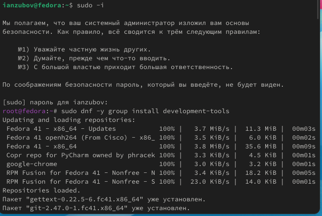
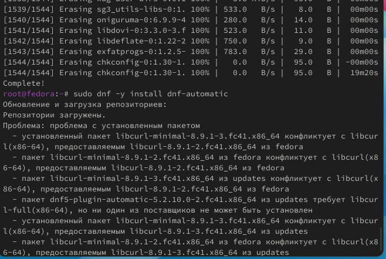
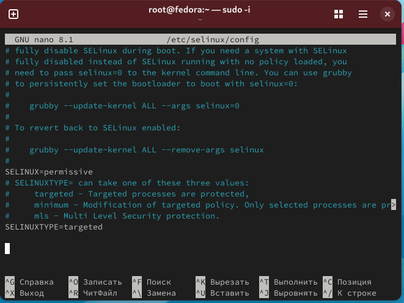
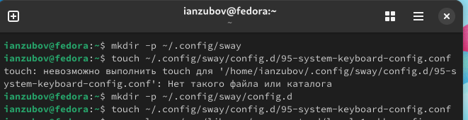
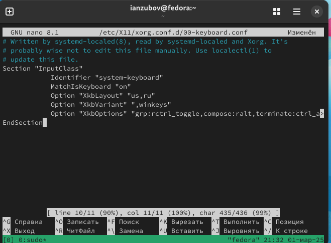
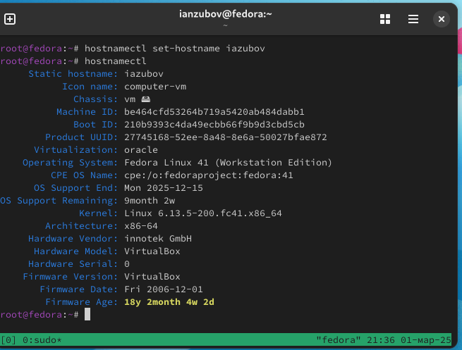
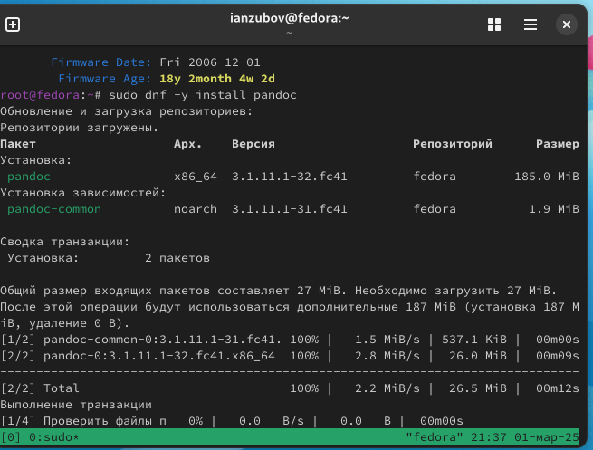
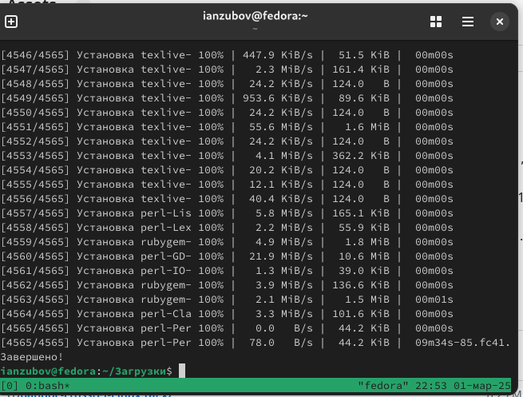
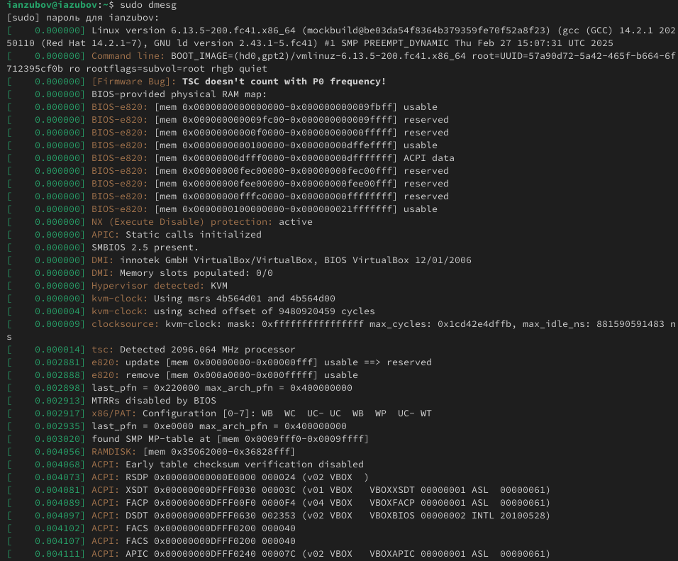
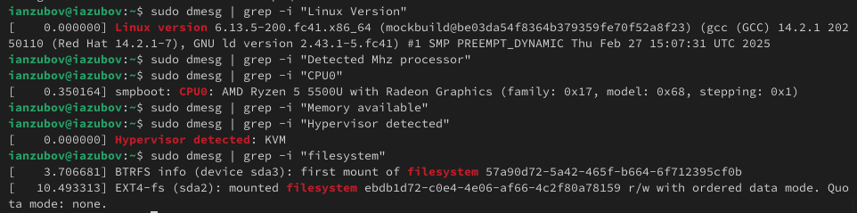

---
## Front matter
lang: ru-RU
title: Лабораторная работа №1
subtitle: Установка OC Linux
author:
  - Зубов И.А. 
institute:
  - Российский университет дружбы народов, Москва, Россия
date: 03 марта 2025

## i18n babel
babel-lang: russian
babel-otherlangs: english

## Formatting pdf
toc: false
toc-title: Содержание
slide_level: 2
aspectratio: 169
section-titles: true
theme: metropolis
header-includes:
 - \metroset{progressbar=frametitle,sectionpage=progressbar,numbering=fraction}
---

# Информация

## Докладчик

  * Зубов Иван Александрович
  * Студент НПИбд-01-24
  * Российский университет дружбы народов
  * 1132243112@pfur.ru

# Выполнение лабораторной работы

## Установим средства разработки и обновим все пакеты 

:::::::::::::: {.columns align=center}
::: {.column width="30%"}

:::
::::::::::::::

## Автоматическое обновление

:::::::::::::: {.columns align=center}
::: {.column width="30%"}

:::
::::::::::::::

## Отключение SELinux

:::::::::::::: {.columns align=center}
::: {.column width="30%"}

:::
::::::::::::::

## Настройка раскладки клавиатуры

:::::::::::::: {.columns align=center}
::: {.column width="30%"}

:::
::::::::::::::

## Настройка раскладки клавиатуры

:::::::::::::: {.columns align=center}
::: {.column width="30%"}

:::
::::::::::::::

## Установка имени пользователя и названия хоста

:::::::::::::: {.columns align=center}
::: {.column width="30%"}

:::
::::::::::::::

## Установка pandoc

:::::::::::::: {.columns align=center}
::: {.column width="30%"}

:::
::::::::::::::

## Установка texlive

:::::::::::::: {.columns align=center}
::: {.column width="30%"}

:::
::::::::::::::

## Домашняя работа 

:::::::::::::: {.columns align=center}
::: {.column width="30%"}

:::
::::::::::::::

:::::::::::::: {.columns align=center}
::: {.column width="30%"}

:::
::::::::::::::

