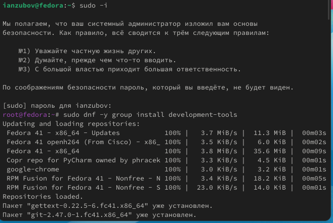
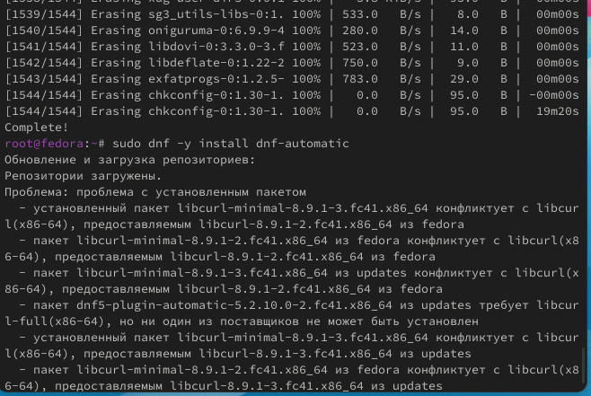
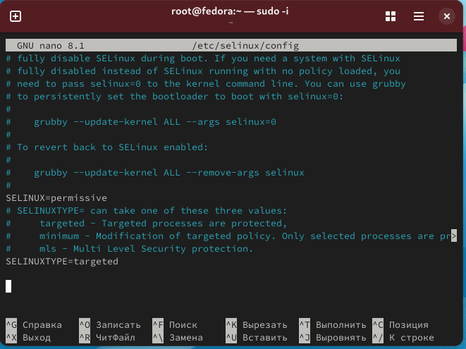
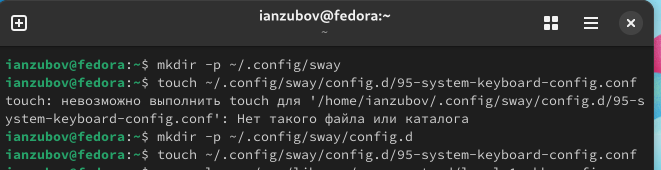
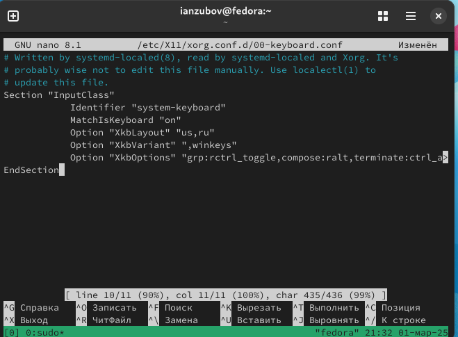
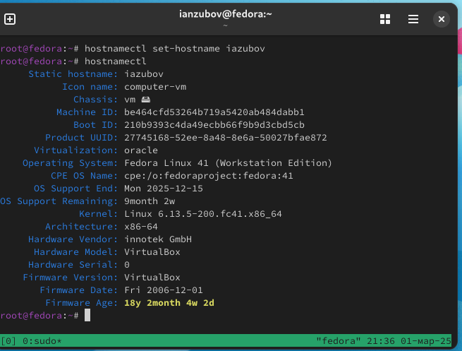
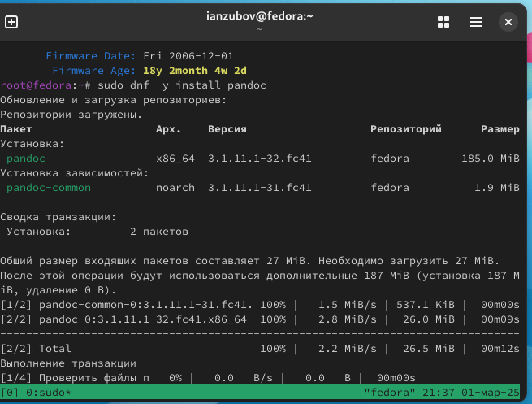
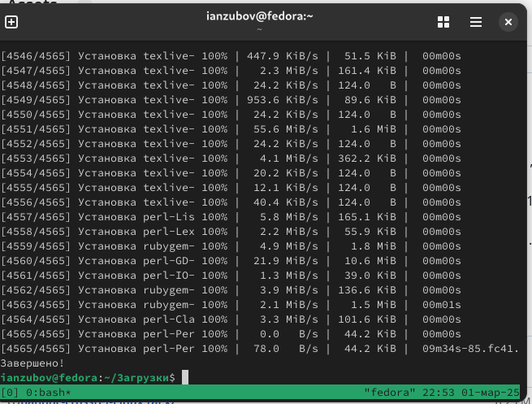
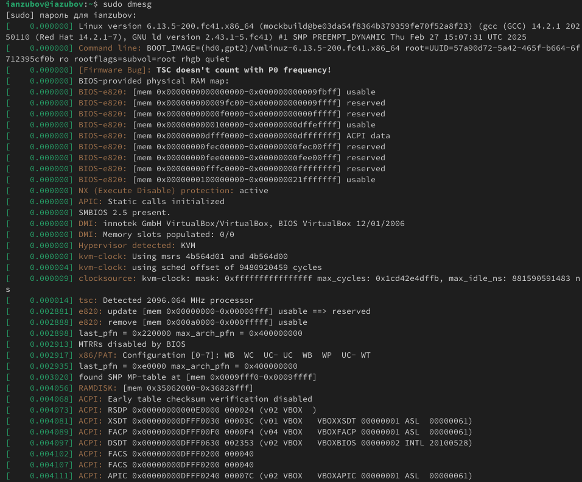
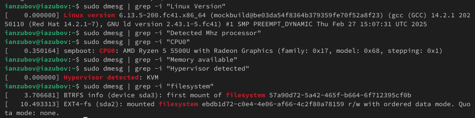

---
## Front matter
title: "Лабораторная работа №1"
subtitle: "Отчет"
author: "Зубов Иван Александрович"

## Generic otions
lang: ru-RU
toc-title: "Содержание"

## Bibliography
bibliography: bib/cite.bib
csl: pandoc/csl/gost-r-7-0-5-2008-numeric.csl

## Pdf output format
toc: true # Table of contents
toc-depth: 2
lof: true # List of figures
lot: true # List of tables
fontsize: 12pt
linestretch: 1.5
papersize: a4
documentclass: scrreprt
## I18n polyglossia
polyglossia-lang:
  name: russian
  options:
	- spelling=modern
	- babelshorthands=true
polyglossia-otherlangs:
  name: english
## I18n babel
babel-lang: russian
babel-otherlangs: english
## Fonts
mainfont: IBM Plex Serif
romanfont: IBM Plex Serif
sansfont: IBM Plex Sans
monofont: IBM Plex Mono
mathfont: STIX Two Math
mainfontoptions: Ligatures=Common,Ligatures=TeX,Scale=0.94
romanfontoptions: Ligatures=Common,Ligatures=TeX,Scale=0.94
sansfontoptions: Ligatures=Common,Ligatures=TeX,Scale=MatchLowercase,Scale=0.94
monofontoptions: Scale=MatchLowercase,Scale=0.94,FakeStretch=0.9
mathfontoptions:
## Biblatex
biblatex: true
biblio-style: "gost-numeric"
biblatexoptions:
  - parentracker=true
  - backend=biber
  - hyperref=auto
  - language=auto
  - autolang=other*
  - citestyle=gost-numeric
## Pandoc-crossref LaTeX customization
figureTitle: "Рис."
tableTitle: "Таблица"
listingTitle: "Листинг"
lofTitle: "Список иллюстраций"
lotTitle: "Список таблиц"
lolTitle: "Листинги"
## Misc options
indent: true
header-includes:
  - \usepackage{indentfirst}
  - \usepackage{float} # keep figures where there are in the text
  - \floatplacement{figure}{H} # keep figures where there are in the text
---

# Цель работы

Целью данной работы является приобретение практических навыков установки операционной системы на виртуальную машину, настройки минимально необходимых для дальнейшей работы сервисов.

# Задание

Установить OC Linux

# Выполнение лабораторной работы

Переключаемся на режим супер пользователя, установим средства разработки и обновим все пакеты

{#fig:001 width=70%}

Установка программного обеспечения с помощью команды sudo dnf -y install dnf-automatic и устновим таймер

{#fig:002 width=70%}

В данном курсе мы не будем рассматривать работу с системой безопасности SELinux.
Поэтому отключим его.
Откроем файл /etc/selinux/config с помощью команды nano и заменим значение
SELINUX=enforcing
на значение
SELINUX=permissive
После этого перезагружаем виртуальную машину
{#fig:003 width=70%}

Создаем конфигурационный файл

{#fig:004 width=70%}

Отредактируйте конфигурационный файл /etc/X11/xorg.conf.d/00-keyboard.conf в режиме суперпользователя и перезагружаем машину

{#fig:005 width=70%}

Создаем имя пользователя,пароль,имя хоста

{#fig:006 width=70%}

Дальше устанавливаем пакеты pandoc. Скачиваем в ручную pandoc crossref с Github, распаковываем пакеты и помещаем их в каталог /usr/local/bin.

{#fig:007 width=70%}

Установим дистрибутив TeXlive

{#fig:008 width=70%}

# Домашнее задание

C помощью команды dmesg | grep -i нам нужно получуть следующую информацию:
Версия ядра Linux (Linux version).
Частота процессора (Detected Mhz processor).
Модель процессора (CPU0).
Объём доступной оперативной памяти (Memory available).
Тип обнаруженного гипервизора (Hypervisor detected).
Тип файловой системы корневого раздела.
Последовательность монтирования файловых систем.

{#fig:009 width=70%}

{#fig:010 width=70%}

# Выводы

Мы установили OC Linux

