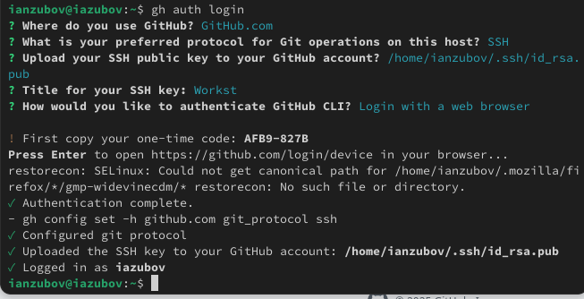

---
## Front matter
lang: ru-RU
title: Лабораторная работа №2
subtitle: Первоначальная настройка git
author:
  - Зубов И.А.
institute:
  - Российский университет дружбы народов, Москва, Россия
date: 03 марта 2025

## i18n babel
babel-lang: russian
babel-otherlangs: english

## Formatting pdf
toc: false
toc-title: Содержание
slide_level: 2
aspectratio: 169
section-titles: true
theme: metropolis
header-includes:
 - \metroset{progressbar=frametitle,sectionpage=progressbar,numbering=fraction}
---

# Информация

## Докладчик

  * Зубов Иван Александрович
  * Студент
  * Российский университет дружбы народов
  * 1132243112@pfur.ru

# Выполнение лабораторной работы

## Установка программного обеспечения 

:::::::::::::: {.columns align=center}
::: {.column width="30%"}

:::
::::::::::::::

## Базовая настройка git

:::::::::::::: {.columns align=center}
::: {.column width="30%"}

:::
::::::::::::::

## Создание ключей ssh

:::::::::::::: {.columns align=center}
::: {.column width="30%"}

:::
::::::::::::::

## Создание ключей pgp

:::::::::::::: {.columns align=center}
::: {.column width="30%"}

:::
::::::::::::::

## Добавление PGP ключа в GitHub

:::::::::::::: {.columns align=center}
::: {.column width="30%"}

:::
::::::::::::::

## Настройка автоматических подписей коммитов git

:::::::::::::: {.columns align=center}
::: {.column width="30%"}

:::
::::::::::::::

## Настройка gh
:::::::::::::: {.columns align=center}
::: {.column width="30%"}

:::
::::::::::::::

## Сознание репозитория курса

:::::::::::::: {.columns align=center}
::: {.column width="30%"}

:::
::::::::::::::

## Настройка каталога курса. Отправляем файлы на сервер

:::::::::::::: {.columns align=center}
::: {.column width="30%"}

:::
::::::::::::::

