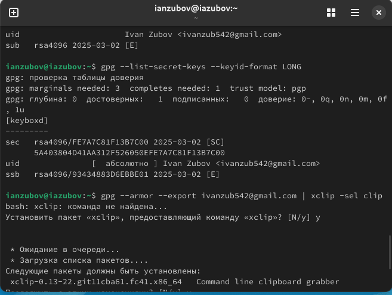
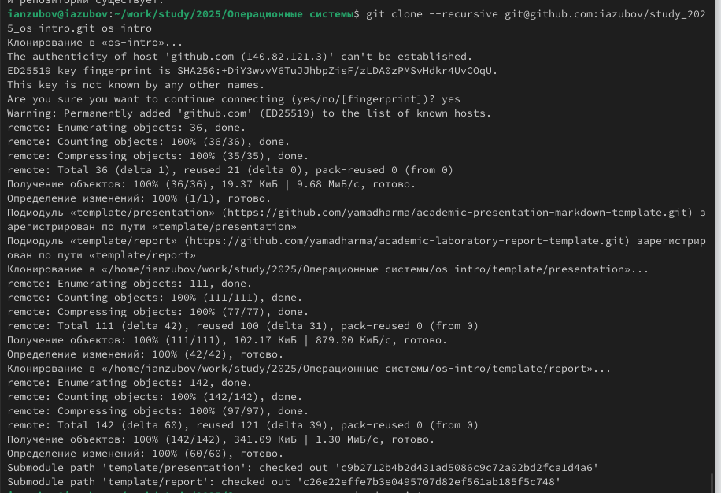

---
## Front matter
title: "Лабораторная работа №2"
subtitle: "Отчет"
author: "Зубов Иван Александрович"

## Generic otions
lang: ru-RU
toc-title: "Содержание"

## Bibliography
bibliography: bib/cite.bib
csl: pandoc/csl/gost-r-7-0-5-2008-numeric.csl

## Pdf output format
toc: true # Table of contents
toc-depth: 2
lof: true # List of figures
lot: true # List of tables
fontsize: 12pt
linestretch: 1.5
papersize: a4
documentclass: scrreprt
## I18n polyglossia
polyglossia-lang:
  name: russian
  options:
	- spelling=modern
	- babelshorthands=true
polyglossia-otherlangs:
  name: english
## I18n babel
babel-lang: russian
babel-otherlangs: english
## Fonts
mainfont: IBM Plex Serif
romanfont: IBM Plex Serif
sansfont: IBM Plex Sans
monofont: IBM Plex Mono
mathfont: STIX Two Math
mainfontoptions: Ligatures=Common,Ligatures=TeX,Scale=0.94
romanfontoptions: Ligatures=Common,Ligatures=TeX,Scale=0.94
sansfontoptions: Ligatures=Common,Ligatures=TeX,Scale=MatchLowercase,Scale=0.94
monofontoptions: Scale=MatchLowercase,Scale=0.94,FakeStretch=0.9
mathfontoptions:
## Biblatex
biblatex: true
biblio-style: "gost-numeric"
biblatexoptions:
  - parentracker=true
  - backend=biber
  - hyperref=auto
  - language=auto
  - autolang=other*
  - citestyle=gost-numeric
## Pandoc-crossref LaTeX customization
figureTitle: "Рис."
tableTitle: "Таблица"
listingTitle: "Листинг"
lofTitle: "Список иллюстраций"
lotTitle: "Список таблиц"
lolTitle: "Листинги"
## Misc options
indent: true
header-includes:
  - \usepackage{indentfirst}
  - \usepackage{float} # keep figures where there are in the text
  - \floatplacement{figure}{H} # keep figures where there are in the text
---

# Цель работы

Изучить идеологию и применение средств контроля версий.
Освоить умения по работе с git.

# Задание

Создать базовую конфигурацию для работы с git.
Создать ключ SSH.
Создать ключ PGP.
Настроить подписи git.
Зарегистрироваться на Github.
Создать локальный каталог для выполнения заданий по предмету.

# Выполнение лабораторной работы

Установим git и gh

{#fig:001 width=70%}

Настраиваем базовые настройки git. Зададим имя и email владельца репозитория. Настроим utf-8 в выводе сообщений git. Зададим имя начальной ветки (будем называть её master)

{#fig:002 width=70%}

Создаем ключ ssh

{#fig:003 width=70%}

Генерируем ключ pgp

{#fig:004 width=70%}

Выводим список ключей и копируем отпечаток приватного ключа. Cкопируем наш сгенерированный PGP ключ в буфер обмена и добавим его на Github

{#fig:005 width=70%}

Используя введёный email, укажим Git применять его при подписи коммитов

{#fig:006 width=70%}

Дальше настроим gh. Для начала необходимо авторизоваться

{#fig:007 width=70%}

С помощью команды mkdir -p ~/work/study/2025/"Операционные системы" создаем каталог и с помощью команды cd входим в него.
С помощью каманды gh repo create study_2025_os-intro --template=yamadharma/course-directory-student-template --public создаем репозиторий на гитхаб и клонируем его

{#fig:008 width=70%}

Перейдите в каталог курса: cd ~/work/study/2022-2023/"Операционные системы"/os-intro. Удалим лишние файлы. Создадим необходимые каталоги и отправим их на сервер. 

{#fig:009 width=70%}

# Выводы

Я освоил умения по работе с Git.
