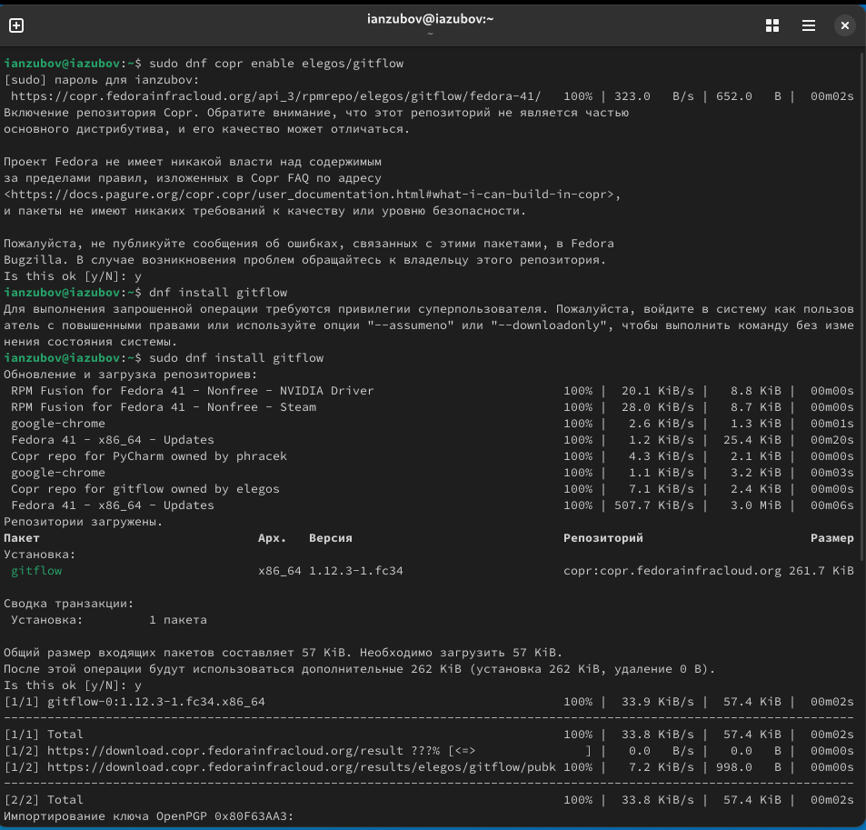
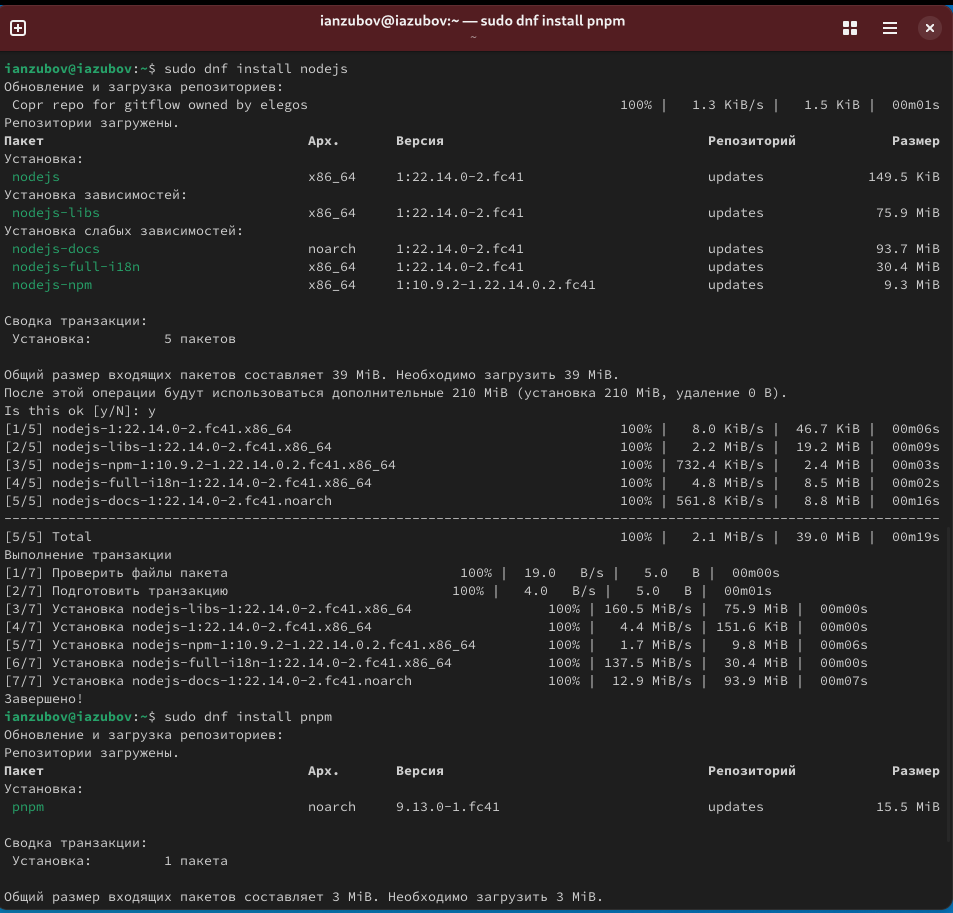
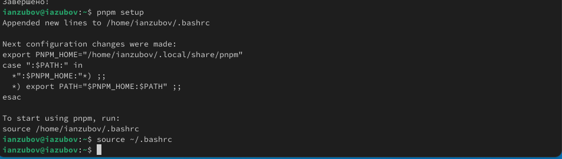
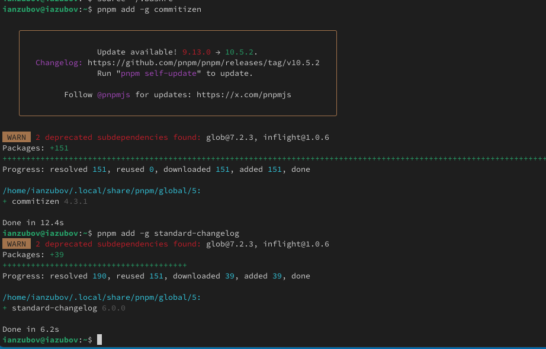
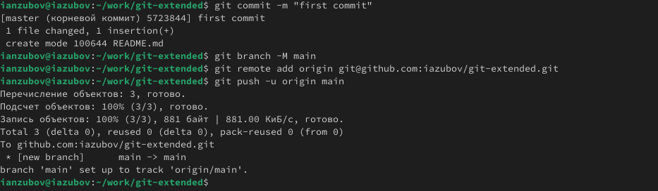
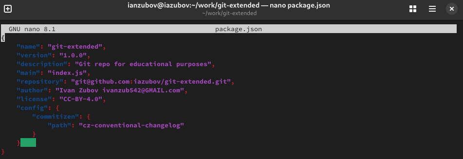
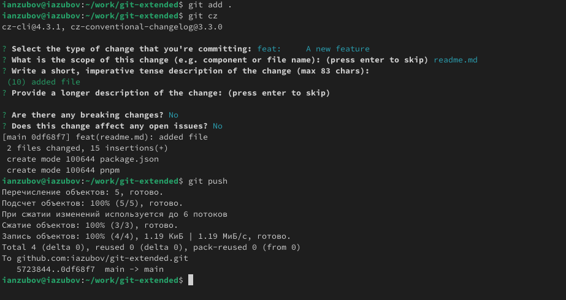
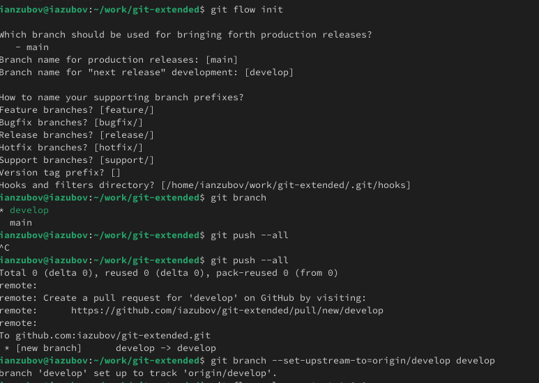
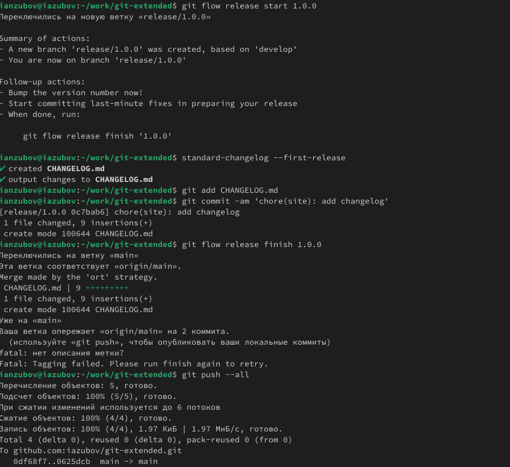
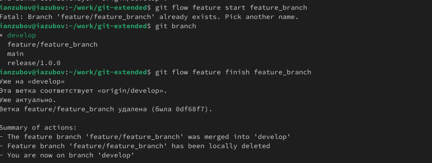

---
## Front matter
lang: ru-RU
title: Лабораторная работа №4
subtitle: Продвинутое использование git
author:
  - Зубов И.А.
institute:
  - Российский университет дружбы народов, Москва, Россия
date: 7 марта 2025

## i18n babel
babel-lang: russian
babel-otherlangs: english

## Formatting pdf
toc: false
toc-title: Содержание
slide_level: 2
aspectratio: 169
section-titles: true
theme: metropolis
header-includes:
 - \metroset{progressbar=frametitle,sectionpage=progressbar,numbering=fraction}
---

# Информация

## Докладчик

  * Зубов Иван Александрович
  * Студент
  * Российский университет дружбы народов
  * 1132243112@pfur.ru

# Выполнение лабораторной работы

## Установка git-flow

:::::::::::::: {.columns align=center}
::: {.column width="30%"}

:::
::::::::::::::

## Установка Node.js

:::::::::::::: {.columns align=center}
::: {.column width="30%"}

:::
::::::::::::::

## Настройка Node.js

:::::::::::::: {.columns align=center}
::: {.column width="30%"}

:::
::::::::::::::

## Общепринятые коммиты

:::::::::::::: {.columns align=center}
::: {.column width="30%"}

:::
::::::::::::::

## Создание репозитория git

Создаем репозиторий, делаем первый коммит и отправляем на Github

:::::::::::::: {.columns align=center}
::: {.column width="30%"}

:::
::::::::::::::

## Редактируем package.json

:::::::::::::: {.columns align=center}
::: {.column width="30%"}

:::
::::::::::::::

## Отправляем на github

Добавляем новые файлы,выполняем коммит и отппавляем на github

:::::::::::::: {.columns align=center}
::: {.column width="30%"}

:::
::::::::::::::

## Конфигурация git-flow

Инициализируем git-flow, загрузите весь репозиторий в хранилище и установите внешнюю ветку как вышестоящую для этой ветки

:::::::::::::: {.columns align=center}
::: {.column width="30%"}

:::
::::::::::::::

## Конфигурация git-flow

Создадим релиз с версией 1.0.0, следующей командой создадим журнал изменений,добавим журнал изменений в индекс, зальём релизную ветку в основную ветку и отправим данные на github

:::::::::::::: {.columns align=center}
::: {.column width="30%"}

:::
::::::::::::::

## Работа с репозиторием git

Создадим ветку для новой функциональности,создадим релиз с версией 1.2.3, зальём релизную ветку в основную ветку и отправим данные на гитхаб

:::::::::::::: {.columns align=center}
::: {.column width="30%"}

:::
::::::::::::::

