---
## Front matter
lang: ru-RU
title: Лабораторная работа №5
subtitle: Презентация
author:
  - Зубов И.А
institute:
  - Российский университет дружбы народов, Москва, Россия

## i18n babel
babel-lang: russian
babel-otherlangs: english

## Formatting pdf
toc: false
toc-title: Содержание
slide_level: 2
aspectratio: 169
section-titles: true
theme: metropolis
header-includes:
 - \metroset{progressbar=frametitle,sectionpage=progressbar,numbering=fraction}
---

# Информация

## Докладчик

  * Зубов Иван Александрович
  * Студент
  * Российский университет дружбы народов
  * 1132243112@pfur.ru

# Выполнение лабораторной работы

## Скачиваем pass и gopass

:::::::::::::: {.columns align=center}
::: {.column width="30%"}

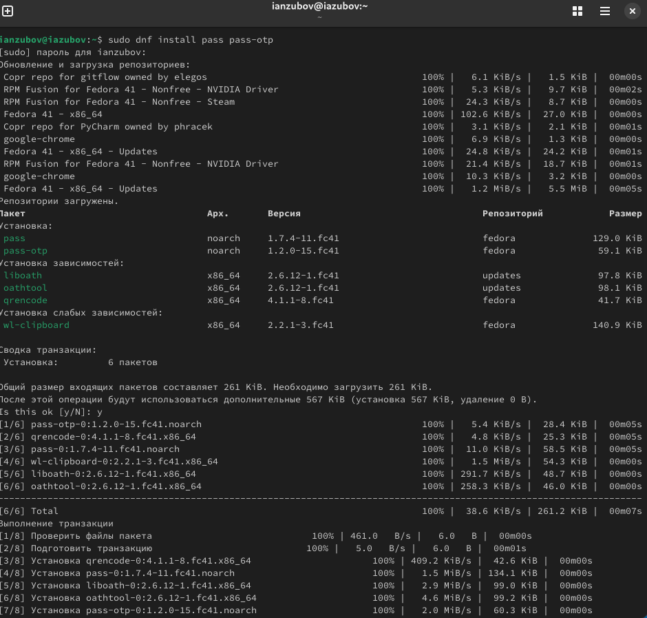

:::
::::::::::::::

## Просмотр списка ключей

Создаем новый репозиторий на gihub. Называем его blog. Переходим в директорию work и клонируем репозиторий

:::::::::::::: {.columns align=center}
::: {.column width="30%"}

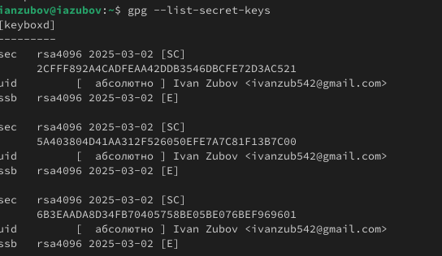

:::
::::::::::::::

## Инициализируем хранилище и синхронизация с git

:::::::::::::: {.columns align=center}
::: {.column width="30%"}

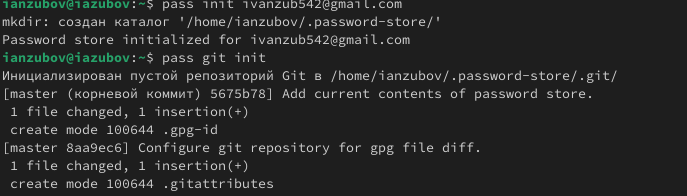

:::
::::::::::::::

## Задаем адрес репозитория на хостинге

:::::::::::::: {.columns align=center}
::: {.column width="30%"}

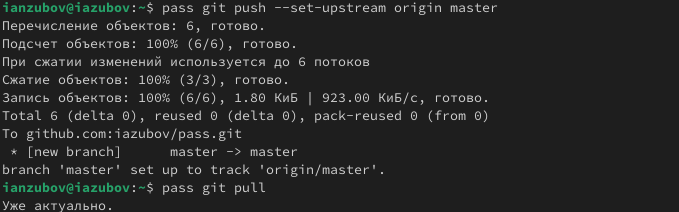

:::
::::::::::::::

## Закоммитим и выложим изменения и проверяем статус синхронизации

:::::::::::::: {.columns align=center}
::: {.column width="30%"}

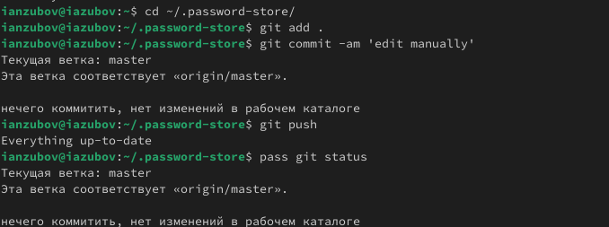

:::
::::::::::::::

## Скачиваем интерфейс для взаимодействия с броузером (native messaging)

:::::::::::::: {.columns align=center}
::: {.column width="30%"}

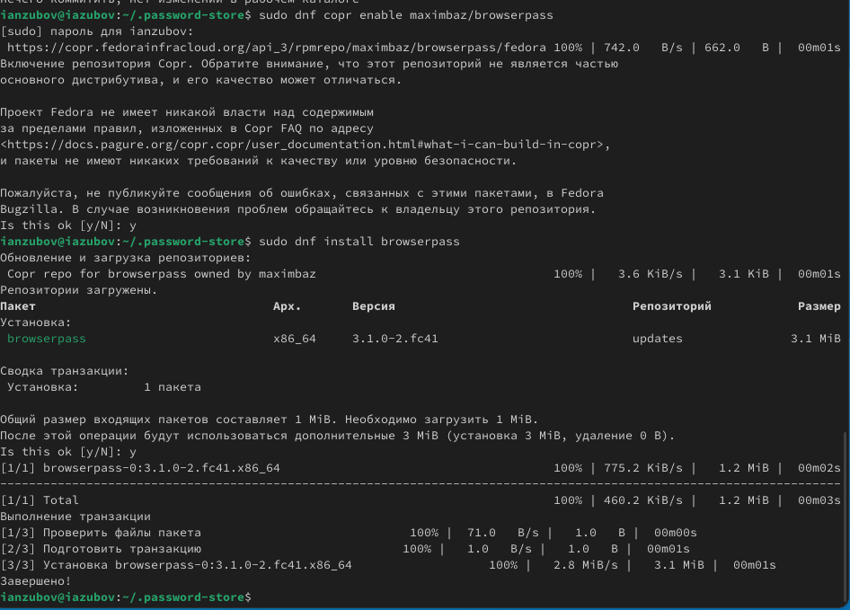

:::
::::::::::::::

## Добавляем свой пароль и заменяем егo

Переходим в папку iazubov.github.io. Делаем бренч и отправляем файла на гитхаб

:::::::::::::: {.columns align=center}
::: {.column width="30%"}

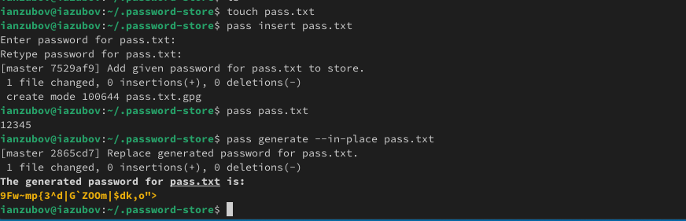

:::
::::::::::::::

## Установим дополнительное программное обеспечение

:::::::::::::: {.columns align=center}
::: {.column width="30%"}

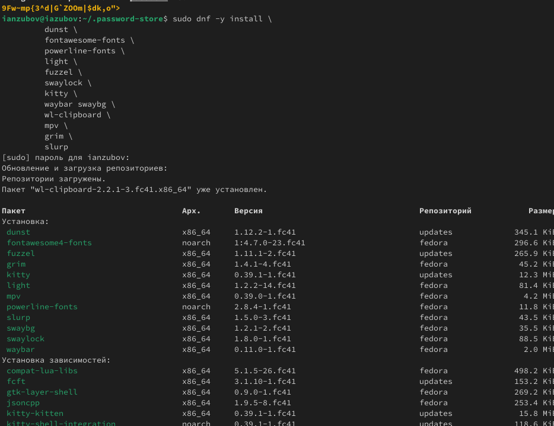

:::
::::::::::::::

## Установим шрифты

:::::::::::::: {.columns align=center}
::: {.column width="30%"}

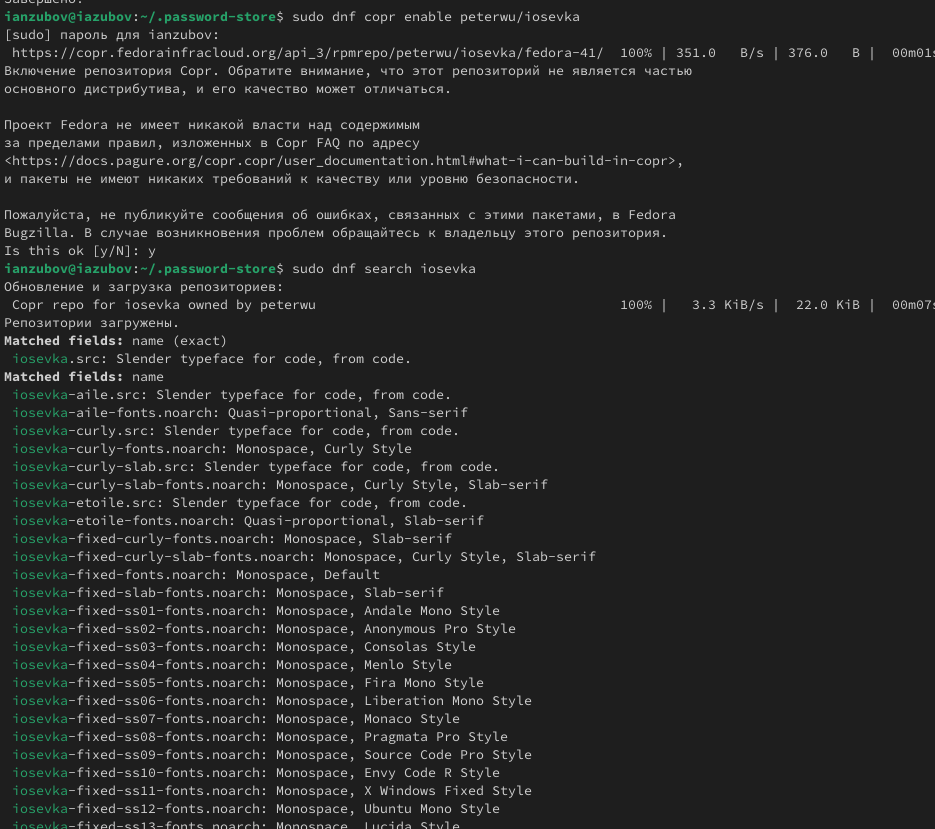

:::
::::::::::::::

## Установка бинарного файла.

:::::::::::::: {.columns align=center}
::: {.column width="30%"}

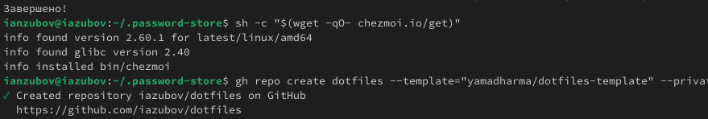

:::
::::::::::::::

## Инициализируйте chezmoi с вашим репозиторием dotfiles и проверим измения

:::::::::::::: {.columns align=center}
::: {.column width="30%"}

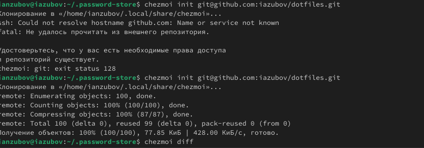

:::
::::::::::::::

## Ежедневные операции c chezmoi

:::::::::::::: {.columns align=center}
::: {.column width="30%"}

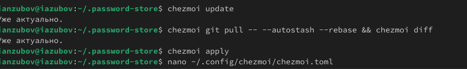

:::
::::::::::::::

