---
## Front matter
title: "Лабораторная работа №5"
subtitle: "Отчет"
author: "Зубов Иван Александрович"

## Generic otions
lang: ru-RU
toc-title: "Содержание"

## Bibliography
bibliography: bib/cite.bib
csl: pandoc/csl/gost-r-7-0-5-2008-numeric.csl

## Pdf output format
toc: true # Table of contents
toc-depth: 2
lof: true # List of figures
lot: true # List of tables
fontsize: 12pt
linestretch: 1.5
papersize: a4
documentclass: scrreprt
## I18n polyglossia
polyglossia-lang:
  name: russian
  options:
	- spelling=modern
	- babelshorthands=true
polyglossia-otherlangs:
  name: english
## I18n babel
babel-lang: russian
babel-otherlangs: english
## Fonts
mainfont: IBM Plex Serif
romanfont: IBM Plex Serif
sansfont: IBM Plex Sans
monofont: IBM Plex Mono
mathfont: STIX Two Math
mainfontoptions: Ligatures=Common,Ligatures=TeX,Scale=0.94
romanfontoptions: Ligatures=Common,Ligatures=TeX,Scale=0.94
sansfontoptions: Ligatures=Common,Ligatures=TeX,Scale=MatchLowercase,Scale=0.94
monofontoptions: Scale=MatchLowercase,Scale=0.94,FakeStretch=0.9
mathfontoptions:
## Biblatex
biblatex: true
biblio-style: "gost-numeric"
biblatexoptions:
  - parentracker=true
  - backend=biber
  - hyperref=auto
  - language=auto
  - autolang=other*
  - citestyle=gost-numeric
## Pandoc-crossref LaTeX customization
figureTitle: "Рис."
tableTitle: "Таблица"
listingTitle: "Листинг"
lofTitle: "Список иллюстраций"
lotTitle: "Список таблиц"
lolTitle: "Листинги"
## Misc options
indent: true
header-includes:
  - \usepackage{indentfirst}
  - \usepackage{float} # keep figures where there are in the text
  - \floatplacement{figure}{H} # keep figures where there are in the text
---

# Цель работы
 Научиться пользоваться операциями chezmoi
 
# Выполнение лабораторной работы

Скачиваем pass и gopass

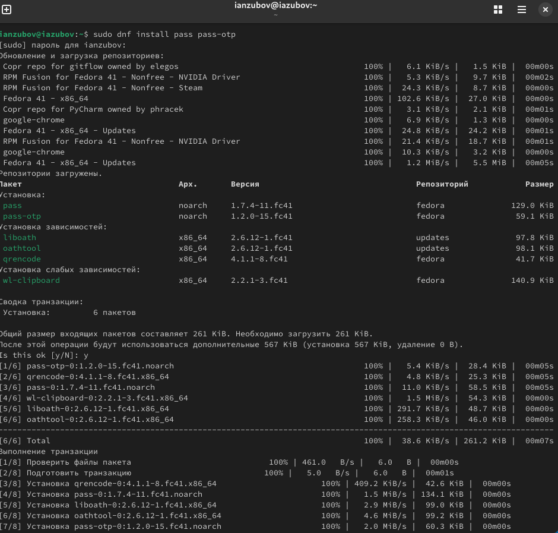{#fig:001 width=70%}

Просмотр списка ключей

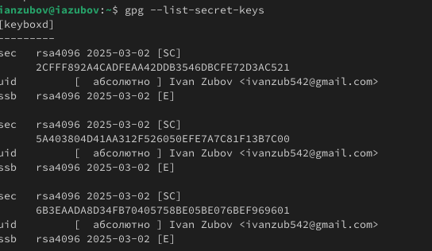{#fig:002 width=70%}

Инициализируем хранилище и синхронизация с git

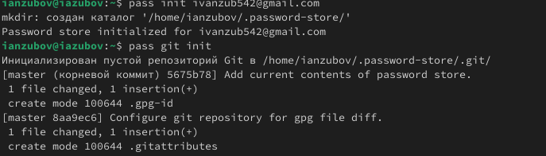{#fig:003 width=70%}

Задаем адрес репозитория на хостинге

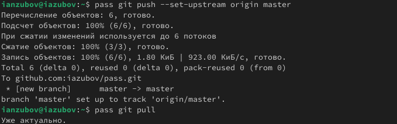{#fig:004 width=70%}

Закоммитим и выложим изменения и проверяем статус синхронизации

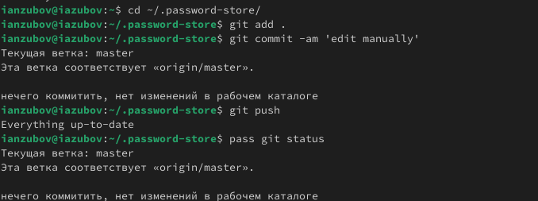{#fig:005 width=70%}

Скачиваем интерфейс для взаимодействия с броузером (native messaging)

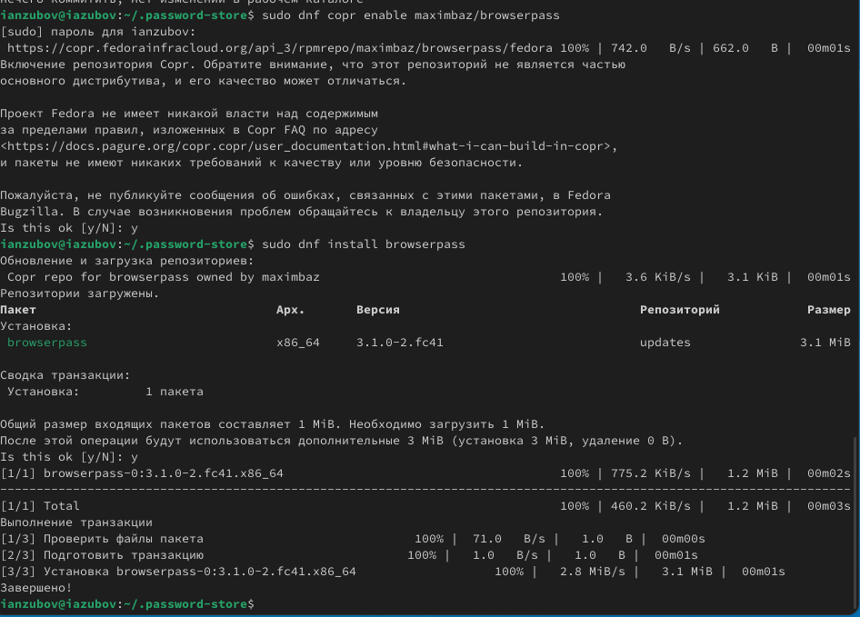{#fig:006 width=70%}

Добавляем свой пароль и заменяем его

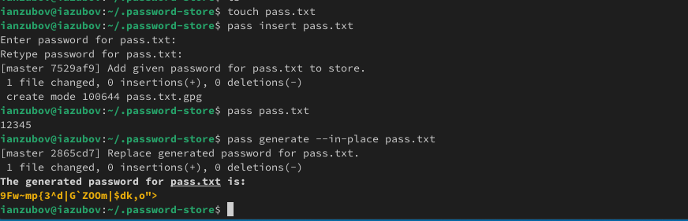{#fig:007 width=70%}

Установим дополнительное программное обеспечение

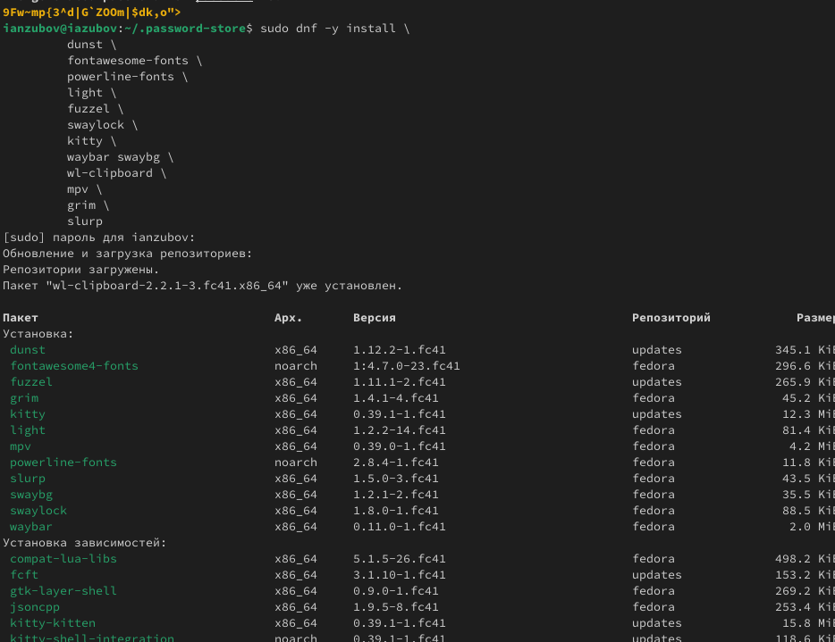{#fig:008 width=70%}

Установим шрифты

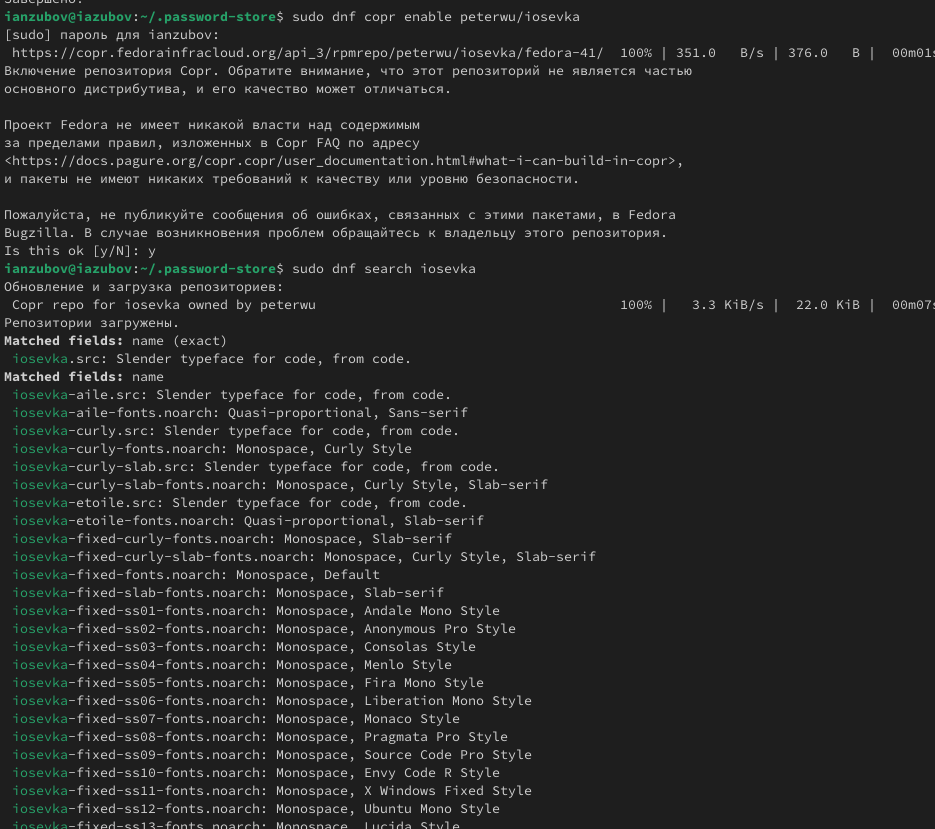{#fig:009 width=70%}

Установка бинарного файла. Создадим новый репозиторий 

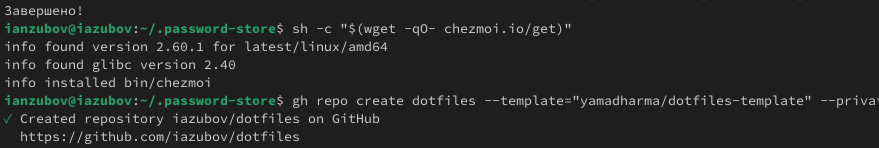{#fig:010 width=70%}

Инициализируйте chezmoi с вашим репозиторием dotfiles и проверим измения

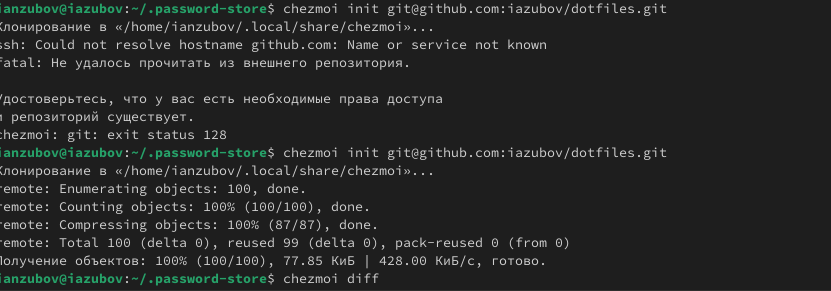{#fig:011 width=70%}

Откроем виртуальную машину, которая осталась у нас с прошлого семестра.Инициализируем chezmoi с вашим репозиторием dotfiles и проверим изменения.

{#fig:111 width=70%}

Извлеките последние изменения из своего репозитория и посмотрите, что изменится, фактически не применяя изменения.Автоматически фиксируйте и отправляйте изменения в репозиторий

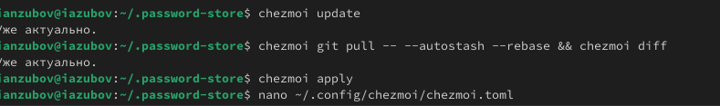{#fig:012 width=70%}

Изменяем файл

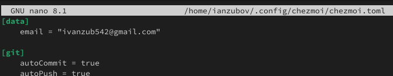{#fig:013 width=70%}

# Выводы

Я научился пользоваться операцией chezmoi

