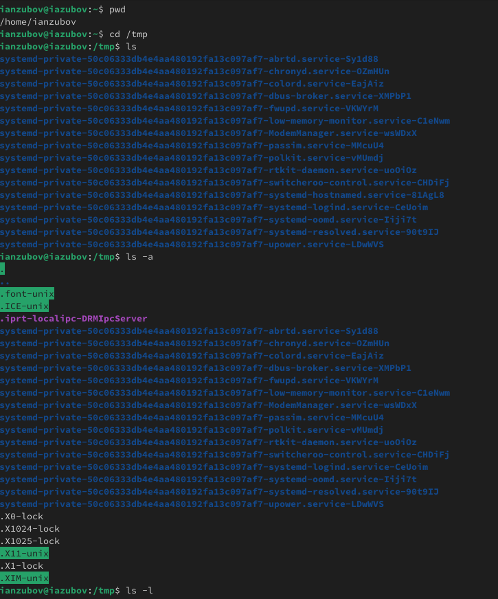
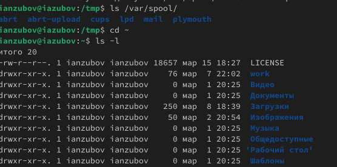
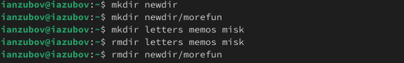
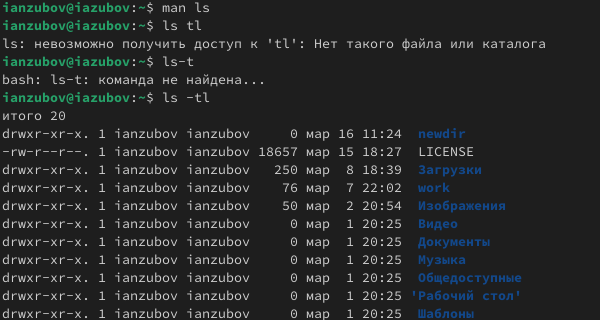
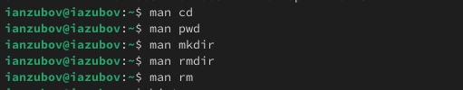
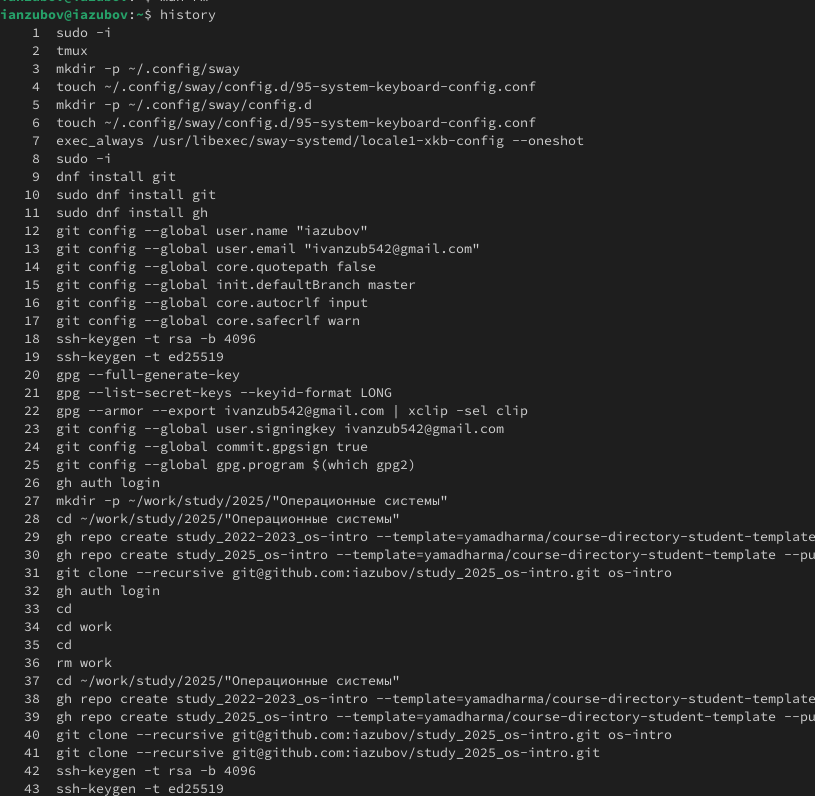
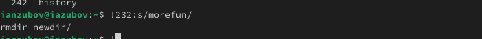

---
## Front matter
lang: ru-RU
title: Лабораторная работа №6
subtitle: Презентация
author:
  - Зубов И.А.
institute:
  - Российский университет дружбы народов, Москва, Россия

## i18n babel
babel-lang: russian
babel-otherlangs: english

## Formatting pdf
toc: false
toc-title: Содержание
slide_level: 2
aspectratio: 169
section-titles: true
theme: metropolis
header-includes:
 - \metroset{progressbar=frametitle,sectionpage=progressbar,numbering=fraction}
---

# Информация

## Докладчик

  * Зубов Иван Александрович
  * Студент
  * Российский университет дружбы народов
  * 1132243112@pfur.ru

# Выполнение лабораторной работы

## Пишем команду pwd и переходим в каталог tmp

Определим полное имя нашего домашнего каталога.Перейдем в каталог /tmp. Выведем на экран содержимое каталога /tmp. Для этого используем команду ls с различными опциями

:::::::::::::: {.columns align=center}
::: {.column width="30%"}

:::
::::::::::::::

## Перейдем в домашний каталог

Определим, есть ли в каталоге /var/spool подкаталог с именем cron. Его нет.Перейдем в наш домашний каталог и выведите на экран его содержимое.
Владельцем католога являюсь непосредственно я 

:::::::::::::: {.columns align=center}
::: {.column width="30%"}

:::
::::::::::::::

## Создаем и удаляем каталоги

:::::::::::::: {.columns align=center}
::: {.column width="30%"}

:::
::::::::::::::

## Команда man

С помощью команды man определим набор опций команды ls, позволяющий отсортировать по времени последнего изменения выводимый список содержимого каталогас развёрнутым описанием файлов.

:::::::::::::: {.columns align=center}
::: {.column width="30%"}

:::
::::::::::::::

## Используtv команду man для просмотра описания следующих команд: cd, pwd, mkdir,rmdir, rm.

:::::::::::::: {.columns align=center}
::: {.column width="30%"}

:::
::::::::::::::

## Вводим команду history

:::::::::::::: {.columns align=center}
::: {.column width="30%"}

:::
::::::::::::::

## При помощи команды history, выполним модификацию и исполнение нескольких команд из буфера команд.

:::::::::::::: {.columns align=center}
::: {.column width="30%"}

:::
::::::::::::::

