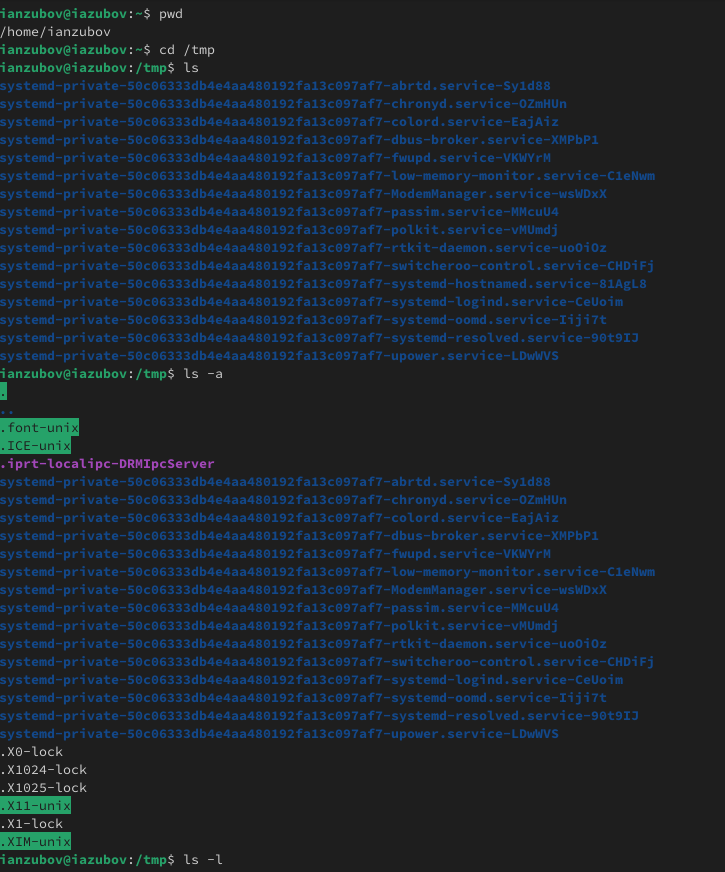
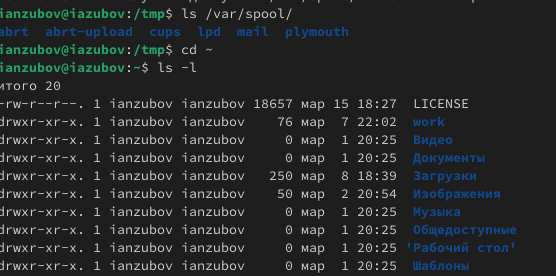
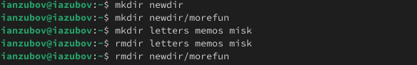
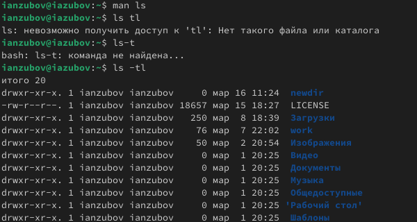
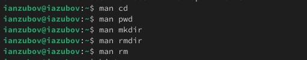
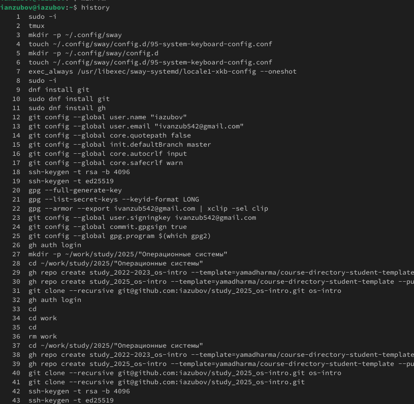
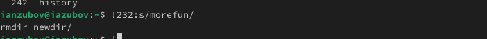

---
## Front matter
title: "Лабораторная работа №6"
subtitle: "Отчет"
author: "Зубов Иван Александрович"

## Generic otions
lang: ru-RU
toc-title: "Содержание"

## Bibliography
bibliography: bib/cite.bib
csl: pandoc/csl/gost-r-7-0-5-2008-numeric.csl

## Pdf output format
toc: true # Table of contents
toc-depth: 2
lof: true # List of figures
lot: true # List of tables
fontsize: 12pt
linestretch: 1.5
papersize: a4
documentclass: scrreprt
## I18n polyglossia
polyglossia-lang:
  name: russian
  options:
	- spelling=modern
	- babelshorthands=true
polyglossia-otherlangs:
  name: english
## I18n babel
babel-lang: russian
babel-otherlangs: english
## Fonts
mainfont: IBM Plex Serif
romanfont: IBM Plex Serif
sansfont: IBM Plex Sans
monofont: IBM Plex Mono
mathfont: STIX Two Math
mainfontoptions: Ligatures=Common,Ligatures=TeX,Scale=0.94
romanfontoptions: Ligatures=Common,Ligatures=TeX,Scale=0.94
sansfontoptions: Ligatures=Common,Ligatures=TeX,Scale=MatchLowercase,Scale=0.94
monofontoptions: Scale=MatchLowercase,Scale=0.94,FakeStretch=0.9
mathfontoptions:
## Biblatex
biblatex: true
biblio-style: "gost-numeric"
biblatexoptions:
  - parentracker=true
  - backend=biber
  - hyperref=auto
  - language=auto
  - autolang=other*
  - citestyle=gost-numeric
## Pandoc-crossref LaTeX customization
figureTitle: "Рис."
tableTitle: "Таблица"
listingTitle: "Листинг"
lofTitle: "Список иллюстраций"
lotTitle: "Список таблиц"
lolTitle: "Листинги"
## Misc options
indent: true
header-includes:
  - \usepackage{indentfirst}
  - \usepackage{float} # keep figures where there are in the text
  - \floatplacement{figure}{H} # keep figures where there are in the text
---

# Цель работы

Приобретение практических навыков взаимодействия пользователя с системой посредством командной строки.

# Задание

1. Определите полное имя вашего домашнего каталога. Далее относительно этого каталога будут выполняться последующие упражнения.
2. Выполните следующие действия:
2.1. Перейдите в каталог /tmp.
2.2. Выведите на экран содержимое каталога /tmp. Для этого используйте команду ls
с различными опциями. Поясните разницу в выводимой на экран информации.
2.3. Определите, есть ли в каталоге /var/spool подкаталог с именем cron?
2.4. Перейдите в Ваш домашний каталог и выведите на экран его содержимое. Определите, кто является владельцем файлов и подкаталогов?
3. Выполните следующие действия:
3.1. В домашнем каталоге создайте новый каталог с именем newdir.
3.2. В каталоге ~/newdir создайте новый каталог с именем morefun.
3.3. В домашнем каталоге создайте одной командой три новых каталога с именами
letters, memos, misk. Затем удалите эти каталоги одной командой.
3.4. Попробуйте удалить ранее созданный каталог ~/newdir командой rm. Проверьте,
был ли каталог удалён.
3.5. Удалите каталог ~/newdir/morefun из домашнего каталога. Проверьте, был ли
каталог удалён.
4. С помощью команды man определите, какую опцию команды ls нужно использовать для просмотра содержимое не только указанного каталога, но и подкаталогов,
входящих в него.
5. С помощью команды man определите набор опций команды ls, позволяющий отсортировать по времени последнего изменения выводимый список содержимого каталога
с развёрнутым описанием файлов.
6. Используйте команду man для просмотра описания следующих команд: cd, pwd, mkdir,
rmdir, rm. Поясните основные опции этих команд.
7. Используя информацию, полученную при помощи команды history, выполните модификацию и исполнение нескольких команд из буфера команд

# Выполнение лабораторной работы

Определим полное имя нашего домашнего каталога.Перейдем в каталог /tmp. Выведем на экран содержимое каталога /tmp. Для этого используем команду ls с различными опциями
Назначение утилиты ls – отображать информацию о директориях (каталогах) и файлах, находящихся в папках. 
ls -a – отображение всего содержимого директории, включая скрытые файлы (их имена начинаются с точки).
ls -l – вывести длинный список с подробной информацией.

{#fig:001 width=70%}

Определим, есть ли в каталоге /var/spool подкаталог с именем cron. Его нет.Перейдем в наш домашний каталог и выведите на экран его содержимое.
Владельцем католога являюсь непосредственно я 

{#fig:002 width=70%}

В домашнем каталоге создаем новый каталог с именем newdir.
В каталоге ~/newdir создаем новый каталог с именем morefun.
В домашнем каталоге создаем одной командой три новых каталога с именами
letters, memos, misk. Затем удалим эти каталоги одной командой.
Попробуем удалить ранее созданный каталог ~/newdir командой rm. 
Удалим каталог ~/newdir/morefun из домашнего каталога.

{#fig:003 width=70%}

С помощью команды man определим набор опций команды ls, позволяющий отсортировать по времени последнего изменения выводимый список содержимого каталогас развёрнутым описанием файлов.

{#fig:004 width=70%}

Используйте команду man для просмотра описания следующих команд: cd, pwd, mkdir,rmdir, rm.
1. cd (Сменить директорию) 
-L: (По умолчанию) Переходит по символическим ссылкам. Если новая директория - ссылка, перейдет в ту директорию, на которую она указывает. 
 -P: Не переходит по символическим ссылкам. Если новая директория - ссылка, перейдет непосредственно к самой ссылке. 
 --: Все последующие аргументы интерпретируются как имена директорий, даже если начинаются с -. 

2. pwd ( Показать текущую директорию) 
-L: Показывает логический путь к текущей директории (следует за символическими ссылками). 
 -P: Показывает физический путь к текущей директории (не следует за символическими ссылками, показывает путь к самой ссылке). 

3. mkdir (Создать директорию) 
 -p (или --parents): Создает родительские директории, если они еще не существуют. Полезно для создания вложенных директорий за один раз. 
-m <режим> (или --mode=<режим>): Устанавливает права доступа (режим) для создаваемой директории. 
 -v (или --verbose): Выводит сообщение о каждой созданной директории.

 4. rmdir ( Удалить директорию)
 -p (или --parents): Удаляет родительские директории, если они становятся пустыми после удаления указанной директории. • -v (или --verbose): Выводит сообщение о каждой удаленной директории. 
--ignore-fail-on-non-empty: Игнорировать ошибки, вызванные только тем, что директория не пуста.

 5. rm ( Удалить) • -f (или --force): Удаляет без запроса подтверждения и игнорирует ошибки, если файл не существует.
 -i: Запрашивает подтверждение перед каждым удалением. 
-I: Запрашивает подтверждение только при удалении более трех файлов или при рекурсивном удалении. Более безопасно, чем -f, но менее навязчиво, чем -i. 
-r (или -R или --recursive): Рекурсивно удаляет директории и их содержимое
 -d (или --dir): Удаляет только пустые директории. 
-v (или --verbose): Выводит сообщение о каждом удаленном файле. 

{#fig:005 width=70%}

Вводим команду history

{#fig:006 width=70%}

При помощи команды history, выполним модификацию и исполнение нескольких команд из буфера команд.

{#fig:007 width=70%}

# Выводы

Мы приобрели практические навыки взаимодействия пользователя с системой посредством командной строки.

