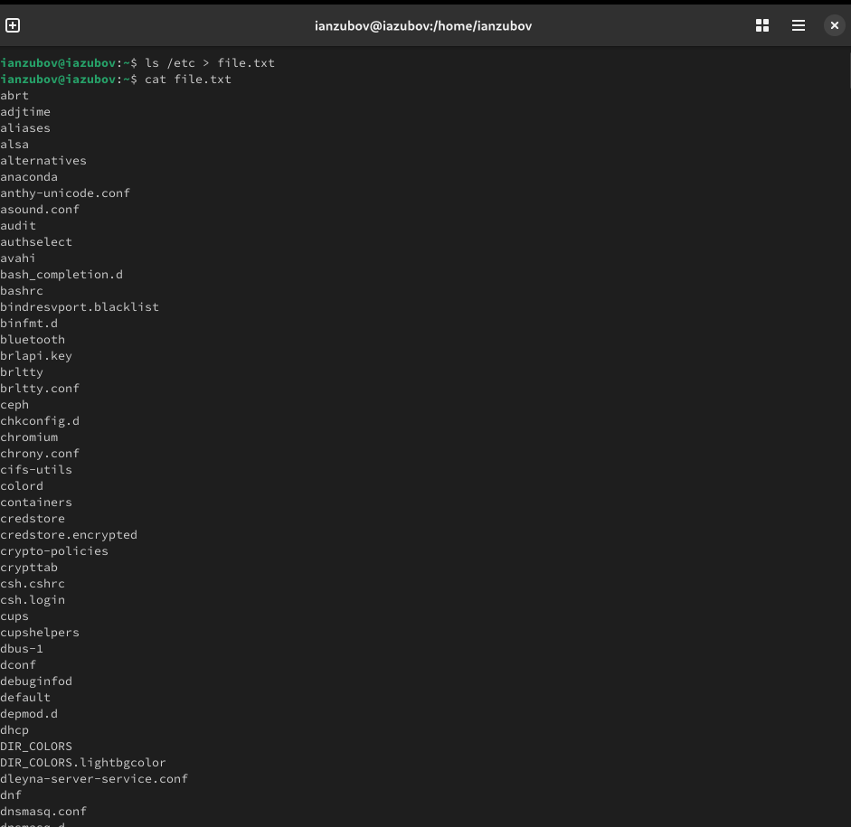
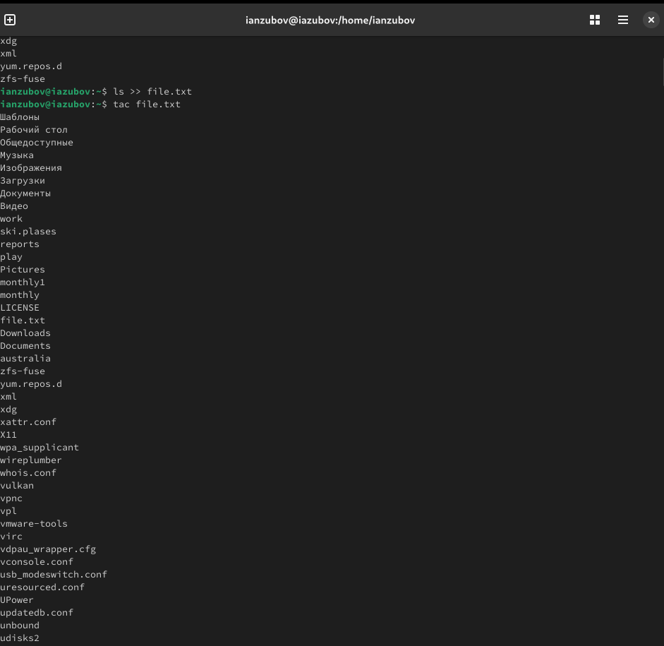
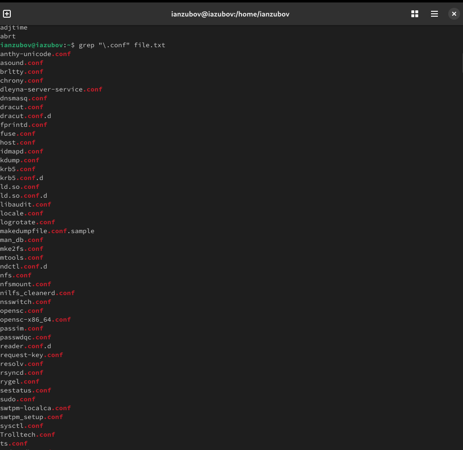
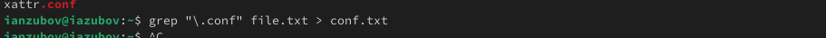
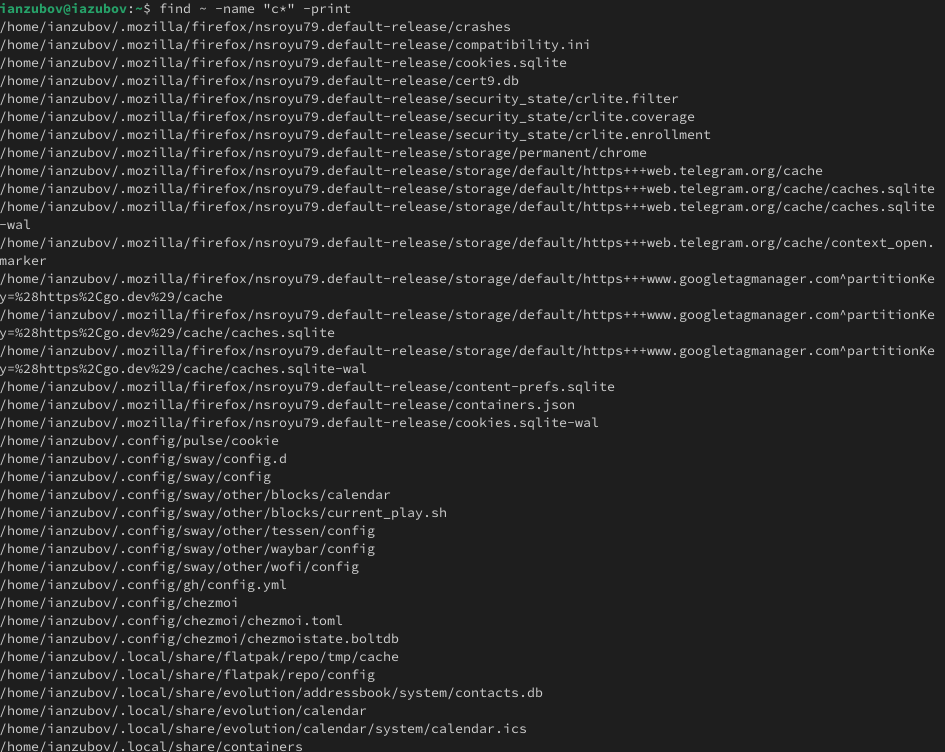
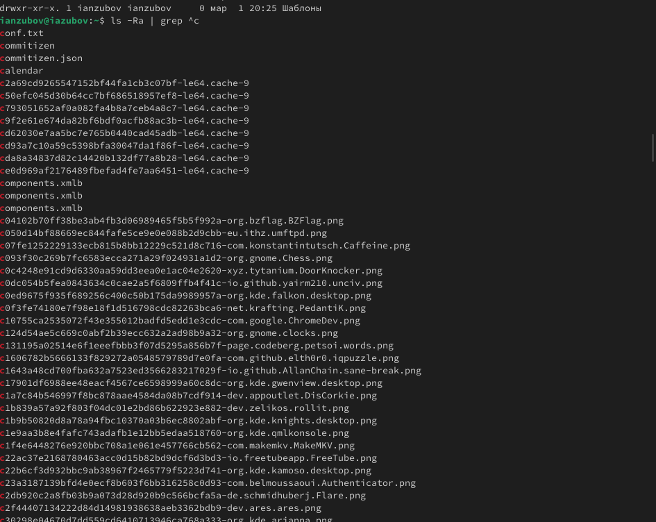
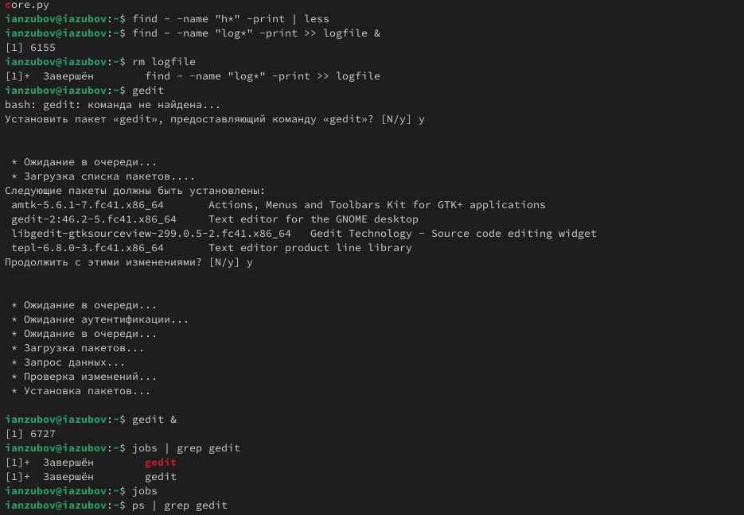
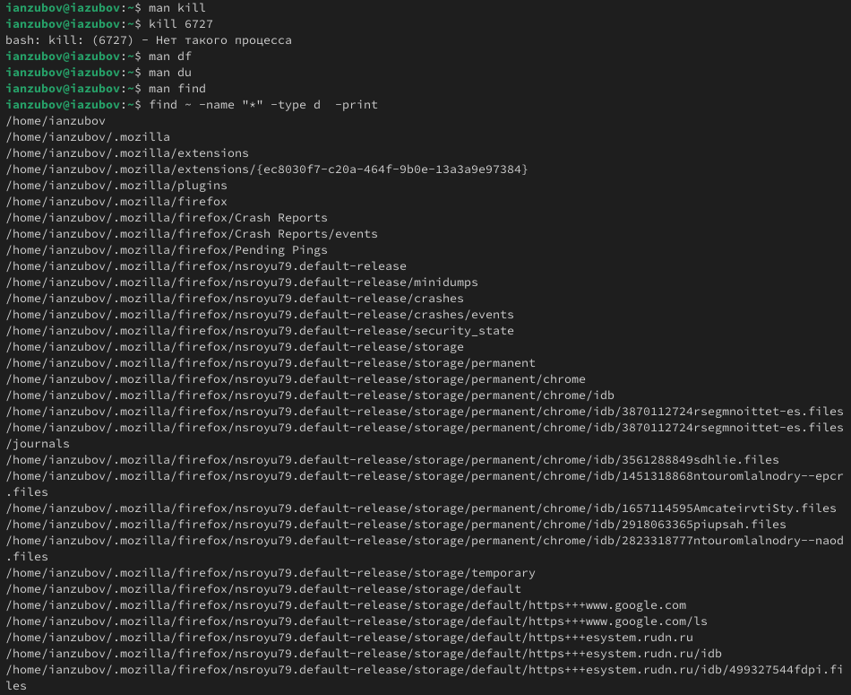

---
## Front matter
lang: ru-RU
title: Лабораторная работа №8
subtitle: Презентация
author:
  - Зубов И.А.
institute:
  - Российский университет дружбы народов, Москва, Россия
date: 05 марта 2025

## i18n babel
babel-lang: russian
babel-otherlangs: english

## Formatting pdf
toc: false
toc-title: Содержание
slide_level: 2
aspectratio: 169
section-titles: true
theme: metropolis
header-includes:
 - \metroset{progressbar=frametitle,sectionpage=progressbar,numbering=fraction}
---

# Информация

## Докладчик

  * Зубов Иван Александрович
  * Студент
  * Российский университет дружбы народов
  * 1132243112@pfur.ru

# Выполнение лабораторной работы

## Запишим в файл file.txt названия файлов, содержащихся в каталоге /etc.

:::::::::::::: {.columns align=center}
::: {.column width="30%"}

:::
::::::::::::::

## Допишем в этот же файл названия файлов, содержащихся в вашем домашнем каталоге.

:::::::::::::: {.columns align=center}
::: {.column width="30%"}

:::
::::::::::::::

## Выведем имена всех файлов из file.txt, имеющих расширение .conf

:::::::::::::: {.columns align=center}
::: {.column width="30%"}

:::
::::::::::::::

## Запишем их в новый текстовой файл conf.txt.

:::::::::::::: {.columns align=center}
::: {.column width="30%"}

:::
::::::::::::::

## Определяем, какие файлы в вашем домашнем каталоге имеют имена, начинавшиеся с символа "с"

:::::::::::::: {.columns align=center}
::: {.column width="30%"}

:::
::::::::::::::

## Определяем, какие файлы в вашем домашнем каталоге имеют имена, начинавшиеся c символа "с"

:::::::::::::: {.columns align=center}
::: {.column width="30%"}

:::
::::::::::::::

## Выполняем задания по выполнению лабораторной работы

Запускаем в фоновом режиме процесс, который будет записывать в файл ~/logfile файлы, имена которых начинаются с log.Удаляем файл ~/logfile.Запускаем из консоли в фоновом режиме редактор gedit.Определяем идентификатор процесса gedit, используя команду ps, конвейер и фильтр grep

:::::::::::::: {.columns align=center}
::: {.column width="30%"}

:::
::::::::::::::

## Команды df,du,find

Завершаем процесс gedit. Выполняем команды df и du, предварительно получив более подробную информацию об этих командах, с помощью команды man.
Воспользовавшись справкой команды find, выводим имена всех директорий, имеющихся в вашем домашнем каталоге

:::::::::::::: {.columns align=center}
::: {.column width="30%"}

:::
::::::::::::::
