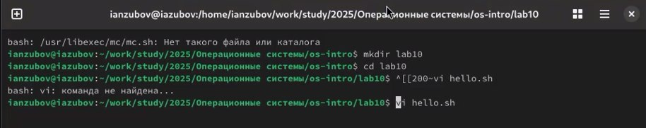
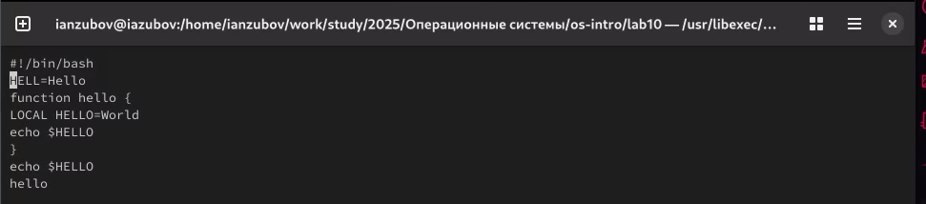
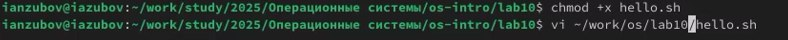
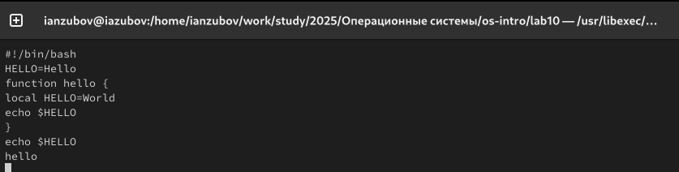

---
## Front matter
title: "Лабораторная работа №10"
subtitle: "Отчет"
author: "Зубов Иван Александрович"

## Generic otions
lang: ru-RU
toc-title: "Содержание"

## Bibliography
bibliography: bib/cite.bib
csl: pandoc/csl/gost-r-7-0-5-2008-numeric.csl

## Pdf output format
toc: true # Table of contents
toc-depth: 2
lof: true # List of figures
lot: true # List of tables
fontsize: 12pt
linestretch: 1.5
papersize: a4
documentclass: scrreprt
## I18n polyglossia
polyglossia-lang:
  name: russian
  options:
	- spelling=modern
	- babelshorthands=true
polyglossia-otherlangs:
  name: english
## I18n babel
babel-lang: russian
babel-otherlangs: english
## Fonts
mainfont: IBM Plex Serif
romanfont: IBM Plex Serif
sansfont: IBM Plex Sans
monofont: IBM Plex Mono
mathfont: STIX Two Math
mainfontoptions: Ligatures=Common,Ligatures=TeX,Scale=0.94
romanfontoptions: Ligatures=Common,Ligatures=TeX,Scale=0.94
sansfontoptions: Ligatures=Common,Ligatures=TeX,Scale=MatchLowercase,Scale=0.94
monofontoptions: Scale=MatchLowercase,Scale=0.94,FakeStretch=0.9
mathfontoptions:
## Biblatex
biblatex: true
biblio-style: "gost-numeric"
biblatexoptions:
  - parentracker=true
  - backend=biber
  - hyperref=auto
  - language=auto
  - autolang=other*
  - citestyle=gost-numeric
## Pandoc-crossref LaTeX customization
figureTitle: "Рис."
tableTitle: "Таблица"
listingTitle: "Листинг"
lofTitle: "Список иллюстраций"
lotTitle: "Список таблиц"
lolTitle: "Листинги"
## Misc options
indent: true
header-includes:
  - \usepackage{indentfirst}
  - \usepackage{float} # keep figures where there are in the text
  - \floatplacement{figure}{H} # keep figures where there are in the text
---

# Цель работы

Познакомиться с операционной системой Linux. Получить практические навыки работы с редактором vi, установленным по умолчанию практически во всех дистрибутивах.

# Задание

1.1. Создайте каталог с именем ~/work/os/lab06.
1.2. Перейдите во вновь созданный каталог.
1.3. Вызовите vi и создайте файл hello.sh
1.4 Нажмите клавишу i и вводите следующий текст.
1.5 Нажмите клавишу Esc для перехода в командный режим после завершения ввода
текста.
1.6. Нажмите : для перехода в режим последней строки и внизу вашего экрана появится
приглашение в виде двоеточия.
1.7. Нажмите w (записать) и q (выйти), а затем нажмите клавишу Enter для сохранения
вашего текста и завершения работы.
1.8. Сделайте файл исполняемым
2.1Вызовите vi на редактирование файла
2.2. Установите курсор в конец слова HELL второй строки.
2.3. Перейдите в режим вставки и замените на HELLO. Нажмите Esc для возврата в командный режим.
2.4. Установите курсор на четвертую строку и сотрите слово LOCAL.
2.5. Перейдите в режим вставки и наберите следующий текст: local, нажмите Esc для
возврата в командный режим.
2.6. Установите курсор на последней строке файла. Вставьте после неё строку, содержащую
следующий текст: echo $HELLO.
2.7. Нажмите Esc для перехода в командный режим.
2.8. Удалите последнюю строку.
2.9. Введите команду отмены изменений u для отмены последней команды.
2.10. Введите символ : для перехода в режим последней строки. Запишите произведённые
изменения и выйдите из vi.

# Выполнение лабораторной работы

Создаем новый каталог и вызывай vi редактор. 

{#fig:001 width=70%}

Вставляем текст и сохраняем

{#fig:002 width=70%}

Вызовим vi на редактирование файла

{#fig:003 width=70%}

Редактируем текст по заданию

{#fig:004 width=70%}

# Выводы

Мы получили практические навыки работы с редактором vi, установленным по умолчанию практически во всех дистрибутивах.

