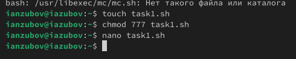
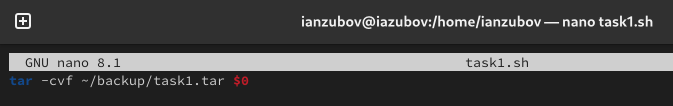
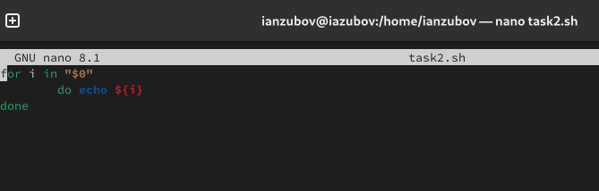
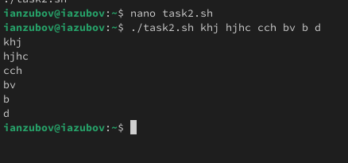
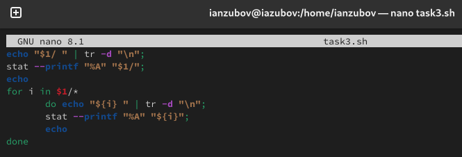
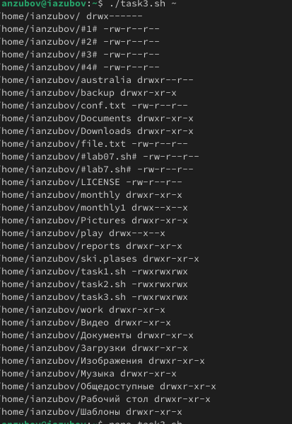
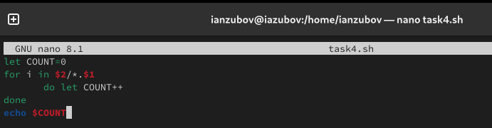
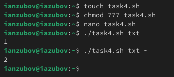

---
## Front matter
lang: ru-RU
title: Лабораторная работа №12
subtitle: Презентация
author:
  - Зубов И.А.
institute:
  - Российский университет дружбы народов, Москва, Россия
date: 29 апреля 2025

## i18n babel
babel-lang: russian
babel-otherlangs: english

## Formatting pdf
toc: false
toc-title: Содержание
slide_level: 2
aspectratio: 169
section-titles: true
theme: metropolis
header-includes:
 - \metroset{progressbar=frametitle,sectionpage=progressbar,numbering=fraction}
---

# Информация

## Докладчик

  * Зубов Иван Александрович
  * Студент
  * Российский университет дружбы народов
  * 1132243112@pfur.ru

# Выполнение лабораторной работы

## Задание 1

Создаем файл task1.sh и пишем скрипт, который при запуске будет делать резервную копию самого себя (то
есть файла, в котором содержится его исходный код) в другую директорию backup
в вашем домашнем каталоге. При этом файл должен архивироваться одним из архиваторов на выбор zip, bzip2 или tar.

:::::::::::::: {.columns align=center}
::: {.column width="30%"}

:::
::::::::::::::

:::::::::::::: {.columns align=center}
::: {.column width="30%"}

:::
::::::::::::::

## Задание 2

Создаем файл task2.sh ,даем ему права доступа и пишем пример командного файла, обрабатывающего любое произвольное число аргументов командной строки, в том числе превышающее десять.

:::::::::::::: {.columns align=center}
::: {.column width="30%"}

:::
::::::::::::::

:::::::::::::: {.columns align=center}
::: {.column width="30%"}

:::
::::::::::::::

## Задание 3

Создаем файл task3.sh, даем ему права доступа и пишем командный файл — аналог команды ls (без использования самой этой команды и команды dir). Требуется, чтобы он выдавал информацию о нужном каталоге и выводил информацию о возможностях доступа к файлам этого каталога.

:::::::::::::: {.columns align=center}
::: {.column width="30%"}

:::
::::::::::::::

:::::::::::::: {.columns align=center}
::: {.column width="30%"}

:::
::::::::::::::

## Задание 4

Создаем файл task4.sh, даем ему права доступа и пишем командный файл, который получает в качестве аргумента командной строки формат файла (.txt, .doc, .jpg, .pdf и т.д.) и вычисляет количество таких файлов
в указанной директории. 

:::::::::::::: {.columns align=center}
::: {.column width="30%"}

:::
::::::::::::::

:::::::::::::: {.columns align=center}
::: {.column width="30%"}

:::
::::::::::::::
