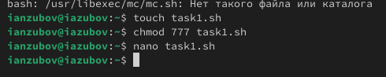
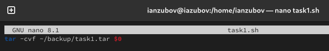
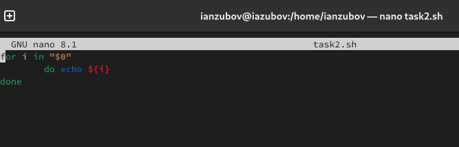
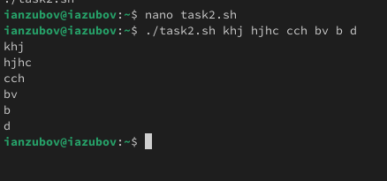
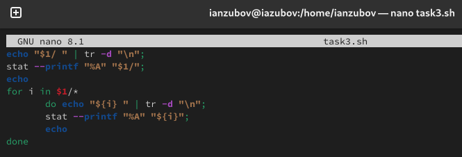
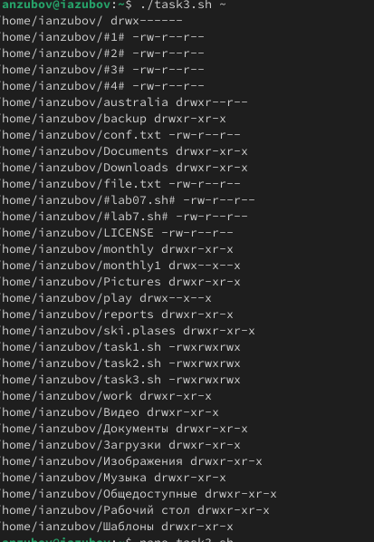
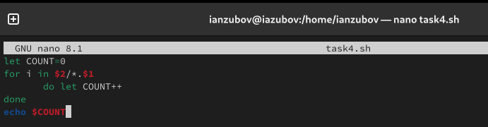
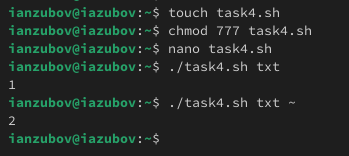

---
## Front matter
title: "Лабораторная работа №12"
subtitle: "Отчет"
author: "Зубов Иван Александрович"

## Generic otions
lang: ru-RU
toc-title: "Содержание"

## Bibliography
bibliography: bib/cite.bib
csl: pandoc/csl/gost-r-7-0-5-2008-numeric.csl

## Pdf output format
toc: true # Table of contents
toc-depth: 2
lof: true # List of figures
lot: true # List of tables
fontsize: 12pt
linestretch: 1.5
papersize: a4
documentclass: scrreprt
## I18n polyglossia
polyglossia-lang:
  name: russian
  options:
	- spelling=modern
	- babelshorthands=true
polyglossia-otherlangs:
  name: english
## I18n babel
babel-lang: russian
babel-otherlangs: english
## Fonts
mainfont: IBM Plex Serif
romanfont: IBM Plex Serif
sansfont: IBM Plex Sans
monofont: IBM Plex Mono
mathfont: STIX Two Math
mainfontoptions: Ligatures=Common,Ligatures=TeX,Scale=0.94
romanfontoptions: Ligatures=Common,Ligatures=TeX,Scale=0.94
sansfontoptions: Ligatures=Common,Ligatures=TeX,Scale=MatchLowercase,Scale=0.94
monofontoptions: Scale=MatchLowercase,Scale=0.94,FakeStretch=0.9
mathfontoptions:
## Biblatex
biblatex: true
biblio-style: "gost-numeric"
biblatexoptions:
  - parentracker=true
  - backend=biber
  - hyperref=auto
  - language=auto
  - autolang=other*
  - citestyle=gost-numeric
## Pandoc-crossref LaTeX customization
figureTitle: "Рис."
tableTitle: "Таблица"
listingTitle: "Листинг"
lofTitle: "Список иллюстраций"
lotTitle: "Список таблиц"
lolTitle: "Листинги"
## Misc options
indent: true
header-includes:
  - \usepackage{indentfirst}
  - \usepackage{float} # keep figures where there are in the text
  - \floatplacement{figure}{H} # keep figures where there are in the text
---

# Цель работы

Изучить основы программирования в оболочке ОС UNIX/Linux. Научиться писать
небольшие командные файлы.

# Задание

1. Написать скрипт, который при запуске будет делать резервную копию самого себя (то
есть файла, в котором содержится его исходный код) в другую директорию backup
в вашем домашнем каталоге. При этом файл должен архивироваться одним из архиваторов на выбор zip, bzip2 или tar. Способ использования команд архивации
необходимо узнать, изучив справку.
2. Написать пример командного файла, обрабатывающего любое произвольное число
аргументов командной строки, в том числе превышающее десять. Например, скрипт
может последовательно распечатывать значения всех переданных аргументов.
3. Написать командный файл — аналог команды ls (без использования самой этой команды и команды dir). Требуется, чтобы он выдавал информацию о нужном каталоге
и выводил информацию о возможностях доступа к файлам этого каталога.
4. Написать командный файл, который получает в качестве аргумента командной строки
формат файла (.txt, .doc, .jpg, .pdf и т.д.) и вычисляет количество таких файлов
в указанной директории. Путь к директории также передаётся в виде аргумента командной строки.

# Выполнение лабораторной работы

Создаем файл task1.sh и пишем скрипт, который при запуске будет делать резервную копию самого себя (то
есть файла, в котором содержится его исходный код) в другую директорию backup
в вашем домашнем каталоге. При этом файл должен архивироваться одним из архиваторов на выбор zip, bzip2 или tar.

{#fig:001 width=70%}

{#fig:002 width=70%}

Создаем файл task2.sh ,даем ему права доступа и пишем пример командного файла, обрабатывающего любое произвольное число аргументов командной строки, в том числе превышающее десять.

{#fig:003 width=70%}

{#fig:004 width=70%}

Создаем файл task3.sh, даем ему права доступа и пишем командный файл — аналог команды ls (без использования самой этой команды и команды dir). Требуется, чтобы он выдавал информацию о нужном каталоге и выводил информацию о возможностях доступа к файлам этого каталога.

{#fig:005 width=70%}

{#fig:006 width=70%}

Создаем файл task4.sh, даем ему права доступа и пишем командный файл, который получает в качестве аргумента командной строки формат файла (.txt, .doc, .jpg, .pdf и т.д.) и вычисляет количество таких файлов
в указанной директории. 

{#fig:007 width=70%}

{#fig:008 width=70%}
# Выводы
 
Я научился писать небольшие командные файлы 

# Контрольные вопросы
1.  Командная оболочка (shell) - это интерфейс между пользователем и ядром ОС, позволяющий запускать программы и управлять системой с помощью текстовых команд.
    *   Примеры: bash, zsh, sh, csh, fish.
    *   Отличия: Синтаксис, набор встроенных команд, возможности настройки, интерактивные функции.
2.  POSIX - набор стандартов IEEE, описывающих интерфейсы операционной системы, обеспечивающие переносимость программ между различными Unix-подобными системами.
3.  Переменные: variable=value (без пробелов).  Массивы: array=(item1 item2 item3).
4.  let: Выполняет арифметические операции. read: Считывает ввод пользователя.
5.  Арифметические операции: +, -, *, /, %, * (возведение в степень).
6.  (( )): Окружает арифметическое выражение для вычисления.
7.  Стандартные переменные: HOME, PATH, USER, PWD, UID, SHELL, PS1 (prompt).
8.  Метасимволы - символы, имеющие специальное значение для командной оболочки (например, *, ?, [], |, >, <).
9.  Экранирование: Обратный слеш \, одинарные кавычки ' ', двойные кавычки " " (частичное экранирование).
10. Создание: Создать текстовый файл с командами. Запуск: bash script.sh или ./script.sh (если файл исполняемый).
11. Определение функции:function function_name() {
  # commands
}

12. Проверка типа файла: if [ -d "filename" ]; then echo "Directory"; fi или if [ -f "filename" ]; then echo "Regular file"; fi
13. Назначение команд:
    *   set: Устанавливает или снимает различные параметры командной оболочки, также отображает все переменные.
    *   typeset: (или declare) Объявляет переменные и задает их атрибуты (например, integer, readonly).
    *   unset: Удаляет переменную.
14. Передача параметров: Аргументы командной строки передаются в командный файл как $1, $2, $3... $9, ${10}, ${11} и т.д.  Все аргументы содержатся в переменной $@.
15. Специальные переменные:
    *   $0: Имя скрипта.
    *   $1, $2, ... $9, ${10} и т.д. : Аргументы командной строки.
    *   $#: Количество аргументов командной строки.
    *   $@: Все аргументы командной строки (как отдельные слова).
    *   $*: Все аргументы командной строки (как одна строка).
    *   $?: Код возврата последней выполненной команды.
    *   $$: PID текущего процесса.
    *   $!: PID последнего запущенного фонового процесса.
