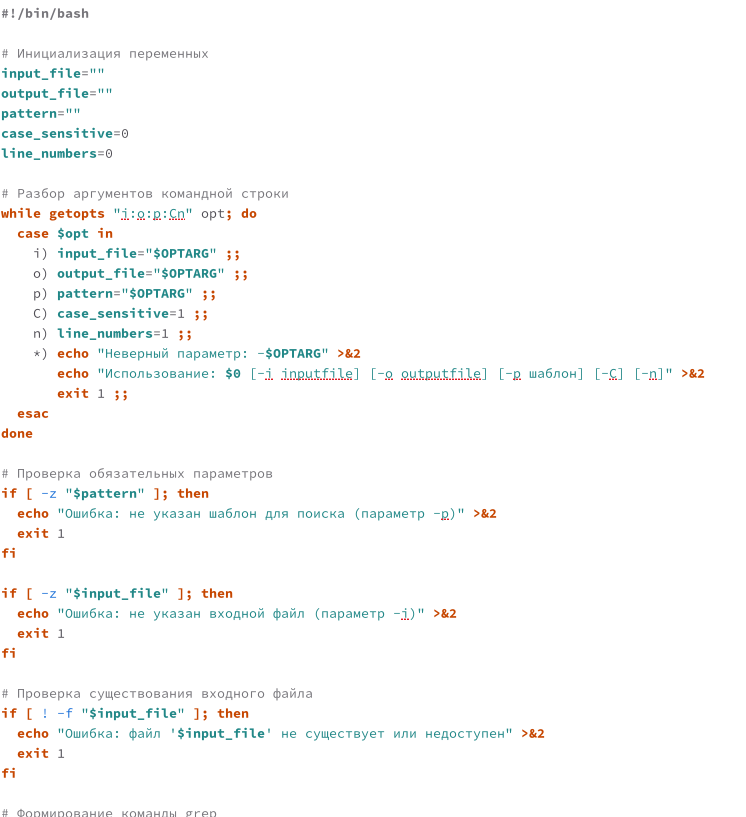
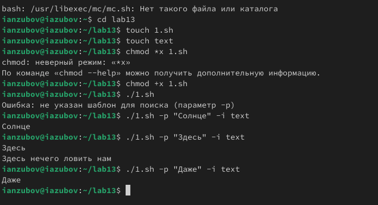
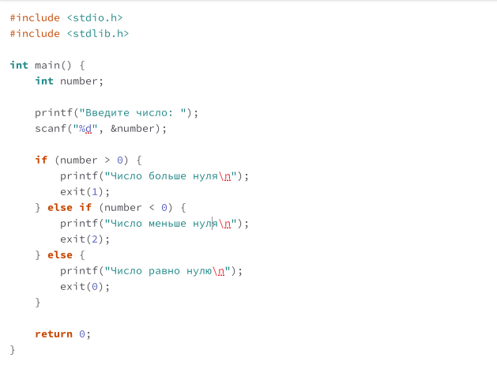
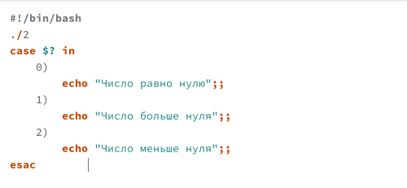
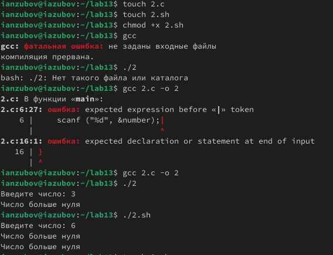
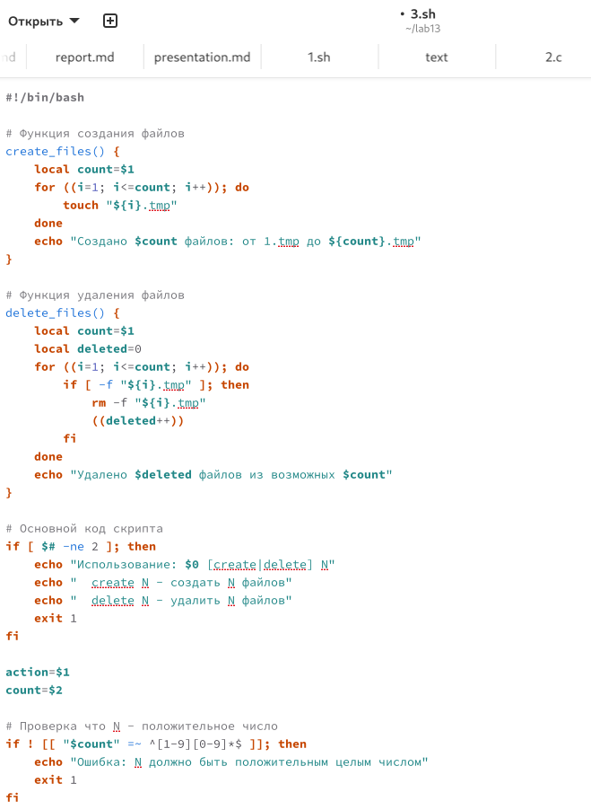
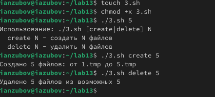
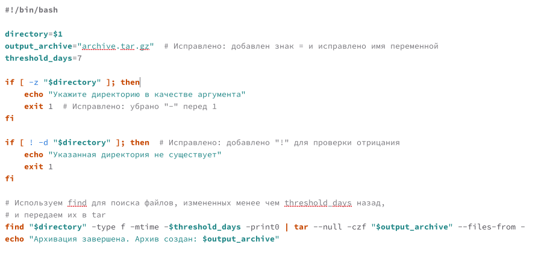
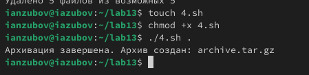
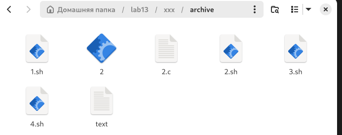

---
## Front matter
lang: ru-RU
title: Лабораторная работа №13
subtitle: Презентация
author:
  - Зубов И.А.
institute:
  - Российский университет дружбы народов, Москва, Россия
date: 01 мая 2025

## i18n babel
babel-lang: russian
babel-otherlangs: english

## Formatting pdf
toc: false
toc-title: Содержание
slide_level: 2
aspectratio: 169
section-titles: true
theme: metropolis
header-includes:
 - \metroset{progressbar=frametitle,sectionpage=progressbar,numbering=fraction}
---

# Информация

## Докладчик

  * Зубов Иван Александрович
  * Студент
  * Российский университет дружбы народов
  * 1132243112@pfur.ru
  
# Задания 

1. Используя команды getopts grep, написать командный файл, который анализирует
командную строку с ключами:
– -iinputfile — прочитать данные из указанного файла;
– -ooutputfile — вывести данные в указанный файл;
– -pшаблон — указать шаблон для поиска;
– -C — различать большие и малые буквы;
– -n — выдавать номера строк.
а затем ищет в указанном файле нужные строки, определяемые ключом -p.
2. Написать на языке Си программу, которая вводит число и определяет, является ли оно
больше нуля, меньше нуля или равно нулю. Затем программа завершается с помощью
функции exit(n), передавая информацию в о коде завершения в оболочку. Командный файл должен вызывать эту программу и, проанализировав с помощью команды
$?, выдать сообщение о том, какое число было введено.
3. Написать командный файл, создающий указанное число файлов, пронумерованных
последовательно от 1 до 𝑁 (например 1.tmp, 2.tmp, 3.tmp,4.tmp и т.д.). Число файлов,
которые необходимо создать, передаётся в аргументы командной строки. Этот же командный файл должен уметь удалять все созданные им файлы (если они существуют).
4. Написать командный файл, который с помощью команды tar запаковывает в архив
все файлы в указанной директории. Модифицировать его так, чтобы запаковывались
только те файлы, которые были изменены менее недели тому назад (использовать
команду find).
  

# Выполнение лабораторной работы

## Выполняем первое задание

Создаем файл 1.sh,пишем код и проверяем его работу

:::::::::::::: {.columns align=center}
::: {.column width="30%"}

:::
::::::::::::::

:::::::::::::: {.columns align=center}
::: {.column width="30%"}

:::
::::::::::::::

## Задание 2

Создаем файл 2.sh и 3.с,пишем код и проверяем его работу

:::::::::::::: {.columns align=center}
::: {.column width="30%"}

:::
::::::::::::::

:::::::::::::: {.columns align=center}
::: {.column width="30%"}

:::
::::::::::::::

:::::::::::::: {.columns align=center}
::: {.column width="30%"}

:::
::::::::::::::

## Задание 3

Создаем файл 3.sh,пишем код и проверяем его работу

:::::::::::::: {.columns align=center}
::: {.column width="30%"}

:::
::::::::::::::

:::::::::::::: {.columns align=center}
::: {.column width="30%"}

:::
::::::::::::::

## Задание 4

Создаем файл 4.sh,пишем код и проверяем его работу

:::::::::::::: {.columns align=center}
::: {.column width="30%"}

:::
::::::::::::::

:::::::::::::: {.columns align=center}
::: {.column width="30%"}

:::
::::::::::::::

:::::::::::::: {.columns align=center}
::: {.column width="30%"}

:::
::::::::::::::
