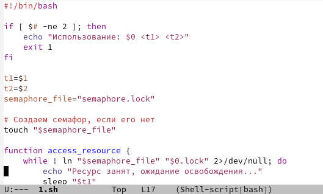
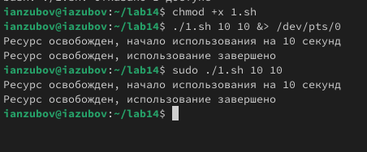
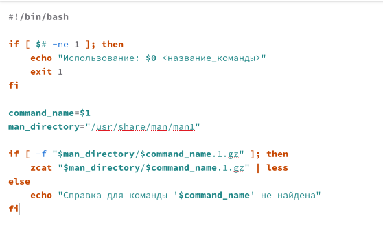
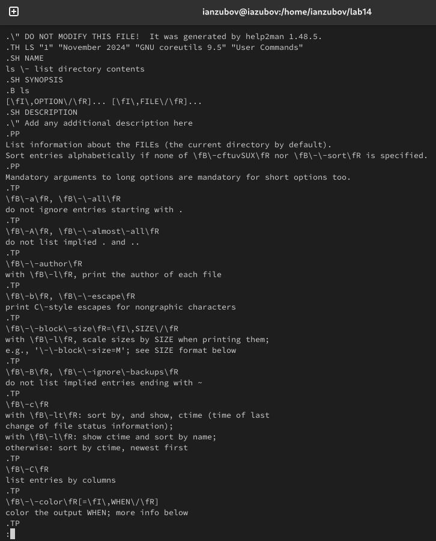
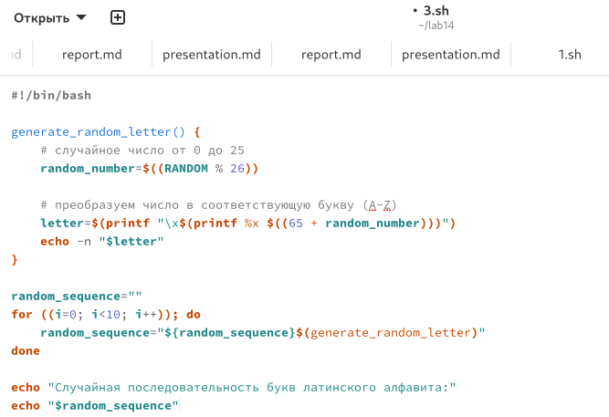
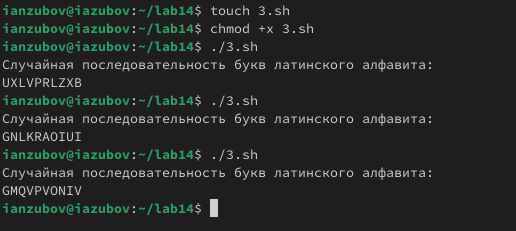

---
## Front matter
lang: ru-RU
title: Лабораторная работа №14
subtitle: Презентация
author:
  - Зубов И.А.
institute:
  - Российский университет дружбы народов, Москва, Россия
date: 16 мая 2025

## i18n babel
babel-lang: russian
babel-otherlangs: english

## Formatting pdf
toc: false
toc-title: Содержание
slide_level: 2
aspectratio: 169
section-titles: true
theme: metropolis
header-includes:
 - \metroset{progressbar=frametitle,sectionpage=progressbar,numbering=fraction}
---

# Информация

## Докладчик

  * Зубов Иван Александрович
  * Студент
  * Российский университет дружбы народов
  * 1132243112@pfur.ru
  
# Задания 

1. Написать командный файл, реализующий упрощённый механизм семафоров. Командный файл должен в течение некоторого времени t1 дожидаться освобождения
ресурса, выдавая об этом сообщение, а дождавшись его освобождения, использовать
его в течение некоторого времени t2<>t1, также выдавая информацию о том, что
ресурс используется соответствующим командным файлом (процессом). Запустить
командный файл в одном виртуальном терминале в фоновом режиме, перенаправив
его вывод в другой (> /dev/tty#, где # — номер терминала куда перенаправляется
вывод), в котором также запущен этот файл, но не фоновом, а в привилегированном
режиме. Доработать программу так, чтобы имелась возможность взаимодействия трёх
и более процессов.
2. Реализовать команду man с помощью командного файла. Изучите содержимое каталога /usr/share/man/man1. В нем находятся архивы текстовых файлов, содержащих
справку по большинству установленных в системе программ и команд. Каждый архив
можно открыть командой less сразу же просмотрев содержимое справки. Командный
файл должен получать в виде аргумента командной строки название команды и в виде
результата выдавать справку об этой команде или сообщение об отсутствии справки,
если соответствующего файла нет в каталоге man1.
3. Используя встроенную переменную $RANDOM, напишите командный файл, генерирующий случайную последовательность букв латинского алфавита. Учтите, что $RANDOM
выдаёт псевдослучайные числа в диапазоне от 0 до 32767.

  

# Выполнение лабораторной работы

## Выполняем первое задание

Создаем файл 1.sh,пишем код и проверяем его работу

:::::::::::::: {.columns align=center}
::: {.column width="30%"}

:::
::::::::::::::

:::::::::::::: {.columns align=center}
::: {.column width="30%"}

:::
::::::::::::::

## Задание 2

Создаем файл 2.sh пишем код и проверяем его работу

:::::::::::::: {.columns align=center}
::: {.column width="30%"}

:::
::::::::::::::

:::::::::::::: {.columns align=center}
::: {.column width="30%"}

:::
::::::::::::::

## Задание 3

Создаем файл 3.sh,пишем код и проверяем его работу

:::::::::::::: {.columns align=center}
::: {.column width="30%"}

:::
::::::::::::::

:::::::::::::: {.columns align=center}
::: {.column width="30%"}

:::
::::::::::::::
