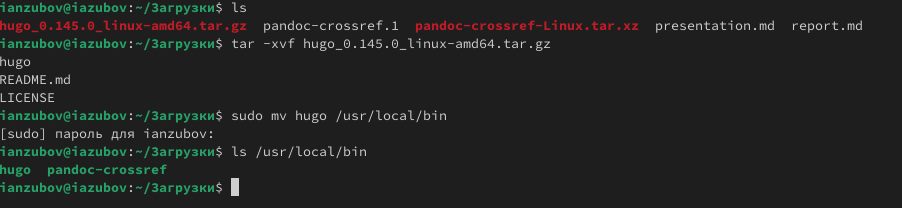
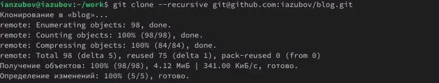
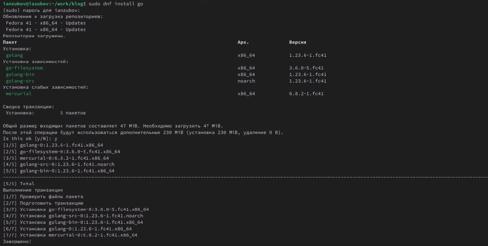
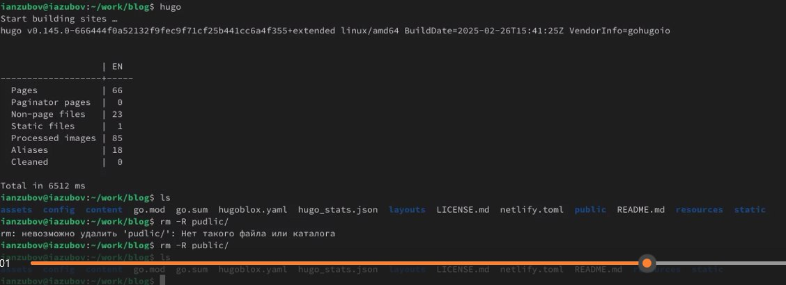
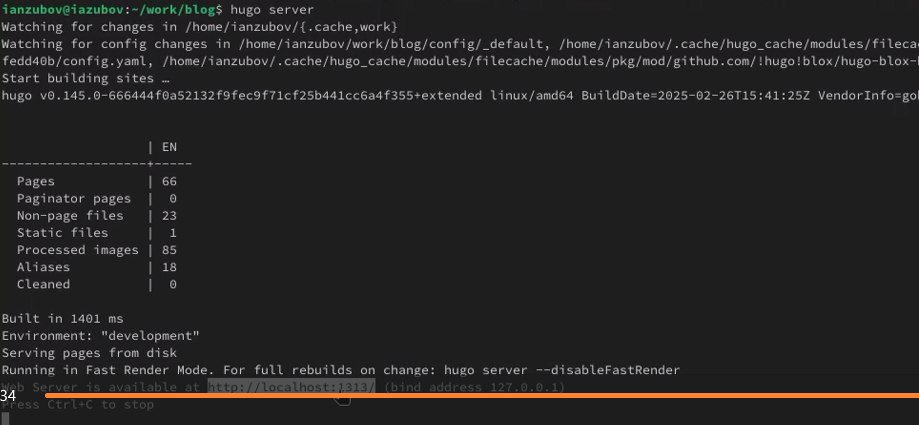
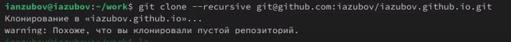
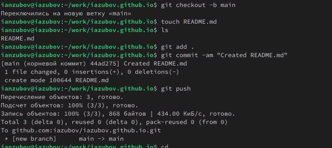
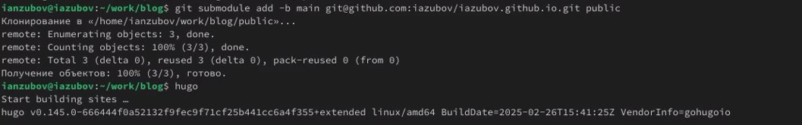
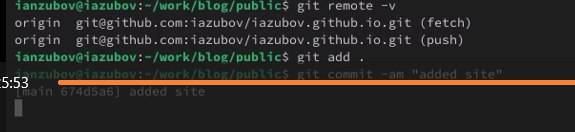

---
## Front matter
lang: ru-RU
title: Индивидуальный проект. Этап 1
subtitle: Размещение на Github pages заготовки для персонального сайта.
author:
  - Зубов И.А
institute:
  - Российский университет дружбы народов, Москва, Россия
date: 08 марта 2025

## i18n babel
babel-lang: russian
babel-otherlangs: english

## Formatting pdf
toc: false
toc-title: Содержание
slide_level: 2
aspectratio: 169
section-titles: true
theme: metropolis
header-includes:
 - \metroset{progressbar=frametitle,sectionpage=progressbar,numbering=fraction}
---

# Информация

## Докладчик

  * Зубов Иван Александрович
  * Студент
  * Российский университет дружбы народов
  * 1132243112@pfur.ru

# Выполнение лабораторной работы

## Скачиваем Hugo и распаковываем его

:::::::::::::: {.columns align=center}
::: {.column width="30%"}

:::
::::::::::::::

## Новый репозиторий

Создаем новый репозиторий на gihub. Называем его blog. Переходим в директорию work и клонируем репозиторий

:::::::::::::: {.columns align=center}
::: {.column width="30%"}

:::
::::::::::::::

## Скачиваем go

:::::::::::::: {.columns align=center}
::: {.column width="30%"}

:::
::::::::::::::

## Удаление pudlic

:::::::::::::: {.columns align=center}
::: {.column width="30%"}

:::
::::::::::::::

## Запускаем сервер

:::::::::::::: {.columns align=center}
::: {.column width="30%"}

:::
::::::::::::::

## Создание репозитория

Теперь нам нужно сделать другой репозиторий на гитхаб. Создаем его и клонируем

:::::::::::::: {.columns align=center}
::: {.column width="30%"}

:::
::::::::::::::

## Делаем бренч

Переходим в папку iazubov.github.io. Делаем бренч и отправляем файла на гитхаб

:::::::::::::: {.columns align=center}
::: {.column width="30%"}

:::
::::::::::::::

## Устанавливаем submodule

:::::::::::::: {.columns align=center}
::: {.column width="30%"}

:::
::::::::::::::

##Проверяем усатновили ли мы submodule и отправляем файлы на github

:::::::::::::: {.columns align=center}
::: {.column width="30%"}

:::
::::::::::::::

