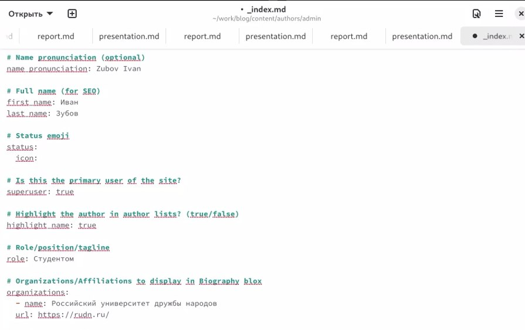

---
## Front matter
lang: ru-RU
title: Индивидуальный проект. Этап 2
subtitle: Презентация
author:
  - Зубов И.А.
institute:
  - Российский университет дружбы народов, Москва, Россия

## i18n babel
babel-lang: russian
babel-otherlangs: english

## Formatting pdf
toc: false
toc-title: Содержание
slide_level: 2
aspectratio: 169
section-titles: true
theme: metropolis
header-includes:
 - \metroset{progressbar=frametitle,sectionpage=progressbar,numbering=fraction}
---

# Информация

## Докладчик

  * Зубов Иван Александрович
  * Студент
  * Российский университет дружбы народов
  * 1132243112@pfur.ru

# Выполнение лабораторной работы

## Размещаем нашу фотографию на сайт

:::::::::::::: {.columns align=center}
::: {.column width="30%"}

:::
::::::::::::::

## Редактируем имя, роль и организацию.

Создаем новый репозиторий на gihub. Называем его blog. Переходим в директорию work и клонируем репозиторий

:::::::::::::: {.columns align=center}
::: {.column width="30%"}

:::
::::::::::::::

## Добавляем информацию о интересах и образовании

:::::::::::::: {.columns align=center}
::: {.column width="30%"}

:::
::::::::::::::

## Размещаем краткое описание владельца сайта

:::::::::::::: {.columns align=center}
::: {.column width="30%"}

:::
::::::::::::::

## Делаем пост по прошедшей неделе

:::::::::::::: {.columns align=center}
::: {.column width="30%"}

:::
::::::::::::::

## Добавляем пост на тему "Управление версиями. Git."

:::::::::::::: {.columns align=center}
::: {.column width="30%"}

:::
::::::::::::::

## C помощью команды hugo server запускаем наш сервер

Переходим в папку iazubov.github.io. Делаем бренч и отправляем файла на гитхаб

:::::::::::::: {.columns align=center}
::: {.column width="30%"}

:::
::::::::::::::

## Отправляем файлы на гитхаб

:::::::::::::: {.columns align=center}
::: {.column width="30%"}

:::
::::::::::::::
