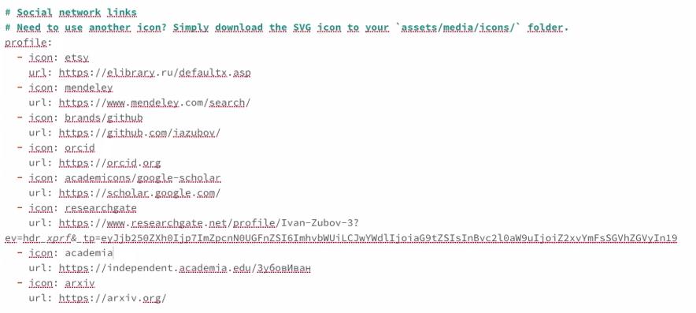
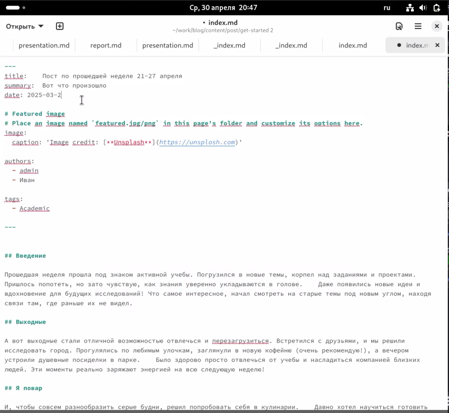
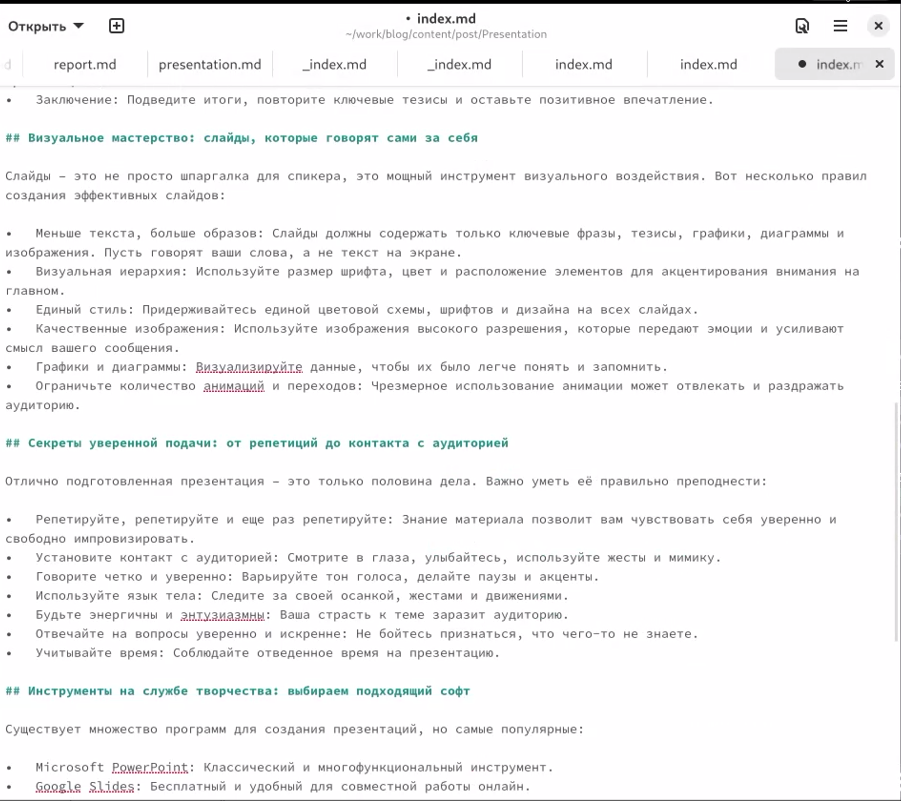

---
## Front matter
lang: ru-RU
title: Индивидуальный проект. Этап 4
subtitle: Презентация
author:
  - Зубов И.А.
institute:
  - Российский университет дружбы народов, Москва, Россия
date: 30 апреля 2025

## i18n babel
babel-lang: russian
babel-otherlangs: english

## Formatting pdf
toc: false
toc-title: Содержание
slide_level: 2
aspectratio: 169
section-titles: true
theme: metropolis
header-includes:
 - \metroset{progressbar=frametitle,sectionpage=progressbar,numbering=fraction}
---

# Информация

## Докладчик

  * Зубов Иван Александрович
  * Студент
  * Российский университет дружбы народов
  * 1132243112@pfur.ru

# Выполнение лабораторной работы

## Добавляем ссылки

Регистрируемся на всех необходим сайтах. Запускаем наш сервер и приступаем редактировать файл. Добавляем ссылки на научные и библиометрические ресурсы

:::::::::::::: {.columns align=center}
::: {.column width="30%"}

:::
::::::::::::::

## Пост по прошедшей неделе

:::::::::::::: {.columns align=center}
::: {.column width="30%"}

:::
::::::::::::::

## Пост на тему "Создание презентаций"

:::::::::::::: {.columns align=center}
::: {.column width="30%"}

:::
::::::::::::::
